# 06_User_Flow.md
# USER FLOW DOCUMENT
# STOREKUIFY — Web Based Grocery Store POS & Inventory Management System

---

## 1. DOCUMENT INFORMATION

| Atribut | Keterangan |
|---|---|
| Nama Dokumen | User Flow Document — StoreKuify |
| Kode Dokumen | 06_User_Flow.md |
| Nama Proyek | StoreKuify |
| Jenis Aplikasi | Web Based Grocery Store POS & Inventory Management System |
| Bahasa Dokumen | Bahasa Indonesia |
| Sumber Kebenaran (Source of Truth) | 02_PRD.md, 03_Business_Rules.md, 04_Information_Architecture.md, 05_Sitemap.md |
| Status Dokumen | Final Draft — Siap untuk Tahap UI Design (Stitch), UX Design, Wireframe, Prototyping, Frontend Development, dan User Journey Validation |
| Disusun Oleh | Senior UX Architect, Business Analyst & Product Designer |
| Tanggal Dibuat | 02 Agustus 2026 |
| Confidentiality | Internal — Hanya untuk Tim Internal & Development Team |

Dokumen ini menjelaskan **BAGAIMANA** pengguna (Owner dan Kasir) berinteraksi dengan StoreKuify untuk menyelesaikan setiap tugas operasional — bukan bagaimana tampilan antarmuka dirancang. Dokumen ini menjadi acuan utama untuk:

- UI Design (Stitch)
- UX Design & Wireframe Design
- Prototyping
- Frontend Development
- User Journey Validation & QA/UAT

Seluruh isi dokumen ini **diturunkan sepenuhnya** dari 02_PRD.md, 03_Business_Rules.md, 04_Information_Architecture.md, dan 05_Sitemap.md. Dokumen ini tidak menambahkan fitur baru, tidak mengubah business rule, dan tidak mengubah struktur navigasi yang telah ditetapkan pada keempat dokumen sumber tersebut.

---

## 2. REVISION HISTORY

| Versi | Tanggal | Deskripsi Perubahan | Disusun Oleh | Disetujui Oleh |
|---|---|---|---|---|
| 0.1 | 02 Agustus 2026 | Draft awal User Flow Document diturunkan dari 02_PRD.md, 03_Business_Rules.md, 04_Information_Architecture.md, dan 05_Sitemap.md | Senior UX Architect, Business Analyst & Product Designer | - |
| 1.0 | 02 Agustus 2026 | Finalisasi seluruh User Flow: Owner Flow, Kasir Flow, Authentication, Dashboard, Data Barang, Kasir/POS, Checkout, Pembayaran, QRIS, Hutang, Laporan, Kelola Kasir, Pengaturan, Profil, Logout, Error Flow, Session Timeout, Future User Flow, dan Glossary | Senior UX Architect, Business Analyst & Product Designer | Product Owner |

Catatan: Setiap perubahan pada 02_PRD.md, 03_Business_Rules.md, 04_Information_Architecture.md, atau 05_Sitemap.md yang memengaruhi alur interaksi pengguna wajib disinkronkan ke dokumen ini dengan menambahkan baris revisi baru.

---

## 3. TABLE OF CONTENTS

1. Document Information
2. Revision History
3. Table of Contents
4. Introduction
5. User Flow Principles
6. Owner User Flow
7. Kasir User Flow
8. Authentication Flow
9. Dashboard Flow
10. Data Barang Flow
11. Kategori Flow
12. Barang Flow
13. Kasir Flow
14. Keranjang Flow
15. Checkout Flow
16. Pembayaran Flow
17. QRIS Flow
18. Hutang Flow
19. Pembayaran Hutang Flow
20. Laporan Flow
21. Kelola Kasir Flow
22. Pengaturan Flow
23. Profil Flow
24. Logout Flow
25. Error Flow
26. Session Timeout Flow
27. Future User Flow
28. Glossary

---

## 4. INTRODUCTION

StoreKuify adalah aplikasi kasir dan manajemen toko berbasis web yang dirancang khusus untuk kebutuhan Warung Kelontong, dengan dua role pengguna: **Owner** dan **Kasir**. Dokumen User Flow ini disusun berdasarkan seluruh Functional Requirement pada 02_PRD.md, Business Rule pada 03_Business_Rules.md, struktur navigasi pada 04_Information_Architecture.md, dan struktur halaman pada 05_Sitemap.md.

Dokumen ini menjabarkan, untuk setiap fitur penting StoreKuify:

- **User Journey** — perjalanan pengguna dari titik awal hingga tujuan tercapai.
- **Task Flow** — langkah demi langkah menyelesaikan sebuah tugas.
- **Happy Path** — jalur normal ketika seluruh langkah berhasil tanpa kendala.
- **Alternative Flow** — jalur alternatif yang tetap valid namun berbeda dari happy path.
- **Exception Flow** — kondisi pengecualian yang mengganggu jalur normal.
- **Error Flow** — respon sistem terhadap kesalahan input maupun kesalahan sistem.
- **Decision Point** — titik keputusan yang menentukan cabang alur berikutnya.
- **User Interaction** — aksi yang dilakukan pengguna.
- **System Response** — respon sistem terhadap aksi pengguna.
- **Role Differences** — perbedaan alur/akses antara Owner dan Kasir.

Dokumen ini **bukan** dokumen UI Design — tidak membahas warna, tipografi, atau tata letak visual. Dokumen ini menjelaskan **logika interaksi**, yang menjadi jembatan antara Business Rules/Information Architecture dengan proses desain visual (Stitch) dan implementasi frontend.

---

## 5. USER FLOW PRINCIPLES

| Prinsip | Penjelasan |
|---|---|
| **Minimal Click** | Setiap tugas penting (transaksi kasir, pencatatan hutang, pengecekan stok) dirancang untuk diselesaikan dengan langkah seminimal mungkin, selaras dengan target waktu transaksi < 30 detik pada 02_PRD.md. |
| **Clear Navigation** | Setiap layar menampilkan breadcrumb dan jalur kembali yang jelas ke halaman induk, sesuai Breadcrumb Structure pada 04_Information_Architecture.md. |
| **Role Based Flow** | Alur yang ditampilkan kepada pengguna menyesuaikan role (Owner/Kasir) sesuai Role Access Matrix dan BR-ROLE-001 s.d. BR-ROLE-007. |
| **Consistent Experience** | Pola interaksi (tombol Simpan, Batal, konfirmasi) konsisten di seluruh modul, sesuai Navigation Rules (NAV-001 s.d. NAV-015) pada 05_Sitemap.md. |
| **Fast Checkout** | Alur Kasir → Keranjang → Checkout → Struk dijaga sesingkat mungkin, tanpa langkah yang tidak perlu, selaras NFR-01 dan NFR-02 pada 02_PRD.md. |
| **Error Recovery** | Setiap kegagalan (validasi, stok, jaringan) memberikan jalur pemulihan yang jelas tanpa kehilangan data yang sudah diinput pengguna, sesuai BR-ERR-004. |
| **Confirmation Before Critical Action** | Aksi destruktif/sensitif (Nonaktifkan Barang, Nonaktifkan Kasir, Logout, Konfirmasi QRIS) selalu meminta konfirmasi eksplisit, sesuai NAV-015. |
| **Prevent Double Submission** | Tombol aksi kritis (Selesaikan Transaksi, Simpan) dikunci (disabled + loading state) selama proses berlangsung untuk mencegah duplikasi transaksi. |
| **Unsaved Changes Handling** | Perubahan pada form yang belum disimpan memicu konfirmasi sebelum pengguna meninggalkan halaman/menutup modal, sesuai NAV-007. |
| **Loading Feedback** | Setiap proses pengambilan/penyimpanan data menampilkan skeleton loading atau spinner sesuai Loading States pada 05_Sitemap.md. |

---

## 6. OWNER USER FLOW

### 6.1 Ringkasan Peran Owner

Owner adalah pemilik warung kelontong dengan **akses penuh** terhadap seluruh 7 modul utama: Dashboard, Data Barang, Kasir, Hutang Pelanggan, Laporan, Kelola Kasir, dan Pengaturan (sesuai Role Access Matrix 02_PRD.md Bagian 7.3, dan BR-ROLE-001).

### 6.2 Owner Journey Map (End-to-End)

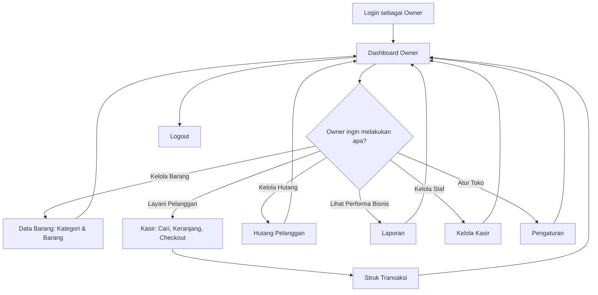
```mermaid
flowchart TD
    A[Login sebagai Owner] --> B[Dashboard Owner]
    B --> C{Owner ingin melakukan apa?}
    C -->|Kelola Barang| D[Data Barang: Kategori & Barang]
    C -->|Layani Pelanggan| E[Kasir: Cari, Keranjang, Checkout]
    C -->|Kelola Hutang| F[Hutang Pelanggan]
    C -->|Lihat Performa Bisnis| G[Laporan]
    C -->|Kelola Staf| H[Kelola Kasir]
    C -->|Atur Toko| I[Pengaturan]
    D --> B
    E --> J[Struk Transaksi]
    J --> B
    F --> B
    G --> B
    H --> B
    I --> B
    B --> K[Logout]
```

### 6.3 Owner Task Flow Table

| No | Tugas Owner | Modul | Related Screen | Business Rules Reference |
|---|---|---|---|---|
| 1 | Login ke sistem | Authentication | SCR-001 | BR-AUTH-001 s.d. BR-AUTH-005 |
| 2 | Memantau ringkasan bisnis harian | Dashboard | SCR-002 | BR-DASH-001, BR-DASH-002 |
| 3 | Mengelola Kategori & Barang | Data Barang | SCR-004–SCR-010 | BR-KAT-001 s.d. BR-BRG-013 |
| 4 | Melayani transaksi penjualan | Kasir/Checkout | SCR-011–SCR-015 | BR-KSR, BR-CART, BR-CHK, BR-PAY |
| 5 | Mengelola hutang pelanggan | Hutang Pelanggan | SCR-016–SCR-018 | BR-HTG-001 s.d. BR-HTG-007 |
| 6 | Melihat laporan penjualan & keuntungan | Laporan | SCR-019 | BR-LAP-001 s.d. BR-LAP-005 |
| 7 | Mengelola akun Kasir | Kelola Kasir | SCR-020–SCR-023 | BR-KKS-001 s.d. BR-KKS-006 |
| 8 | Mengatur profil toko, QRIS, profil sendiri | Pengaturan | SCR-024–SCR-026 | BR-SET-001 s.d. BR-SET-003 |
| 9 | Logout | Authentication | - | BR-AUTH-006, BR-SESS-002 |

**Role Differences:** Owner adalah satu-satunya role yang dapat mengakses Laporan, Kelola Kasir, dan Pengaturan Toko (BR-ROLE-004, BR-ROLE-005, BR-ROLE-006). Owner juga satu-satunya role yang dapat mengubah Data Barang dan Kategori (BR-ROLE-003).

---

## 7. KASIR USER FLOW

### 7.1 Ringkasan Peran Kasir

Kasir adalah staf operasional dengan akses terbatas (least-privilege): Dashboard (versi ringkas), Data Barang (Read Only), Kasir (transaksi), Hutang Pelanggan, dan Profil Saya (sesuai 02_PRD.md Bagian 7.2, BR-ROLE-002).

### 7.2 Kasir Journey Map (End-to-End)

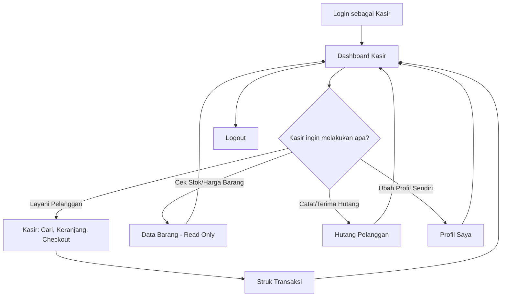
```mermaid
flowchart TD
    A[Login sebagai Kasir] --> B[Dashboard Kasir]
    B --> C{Kasir ingin melakukan apa?}
    C -->|Layani Pelanggan| D[Kasir: Cari, Keranjang, Checkout]
    C -->|Cek Stok/Harga Barang| E[Data Barang - Read Only]
    C -->|Catat/Terima Hutang| F[Hutang Pelanggan]
    C -->|Ubah Profil Sendiri| G[Profil Saya]
    D --> H[Struk Transaksi]
    H --> B
    E --> B
    F --> B
    G --> B
    B --> I[Logout]
```

### 7.3 Kasir Task Flow Table

| No | Tugas Kasir | Modul | Related Screen | Business Rules Reference |
|---|---|---|---|---|
| 1 | Login ke sistem | Authentication | SCR-001 | BR-AUTH-001 s.d. BR-AUTH-005 |
| 2 | Memantau ringkasan operasional harian | Dashboard | SCR-003 | BR-DASH-001, BR-DASH-003 |
| 3 | Melihat data barang (read only) | Data Barang | SCR-004–SCR-008 | BR-BRG-013, BR-ROLE-003 |
| 4 | Melayani transaksi penjualan | Kasir/Checkout | SCR-011–SCR-015 | BR-KSR, BR-CART, BR-CHK, BR-PAY |
| 5 | Mencatat & menerima pembayaran hutang | Hutang Pelanggan | SCR-016–SCR-018 | BR-HTG-001 s.d. BR-HTG-007 |
| 6 | Mengubah profil sendiri | Profil Saya | SCR-027 | BR-KKS-006 |
| 7 | Logout | Authentication | - | BR-AUTH-006, BR-SESS-002 |

**Role Differences:** Kasir tidak dapat mengubah Barang/Kategori (BR-ROLE-003), tidak dapat melihat Laporan Keuangan (BR-ROLE-004), tidak dapat mengelola akun Kasir lain (BR-ROLE-005), dan tidak dapat mengubah Pengaturan Toko (BR-ROLE-006). Percobaan akses langsung via URL ditolak dengan halaman 403 (BR-ROLE-007).

---

## 8. AUTHENTICATION FLOW

### FL-AUTH-01 — Login

| Field | Detail |
|---|---|
| **Flow ID** | FL-AUTH-01 |
| **Flow Name** | Login ke Sistem |
| **Actor** | Owner, Kasir |
| **Goal** | Pengguna berhasil masuk ke sistem dan diarahkan ke Dashboard sesuai role |
| **Pre-condition** | Pengguna memiliki akun terdaftar dan berstatus aktif |
| **Trigger** | Pengguna membuka aplikasi StoreKuify (belum memiliki sesi aktif) |
| **Related Screen** | SCR-001 (Login) |
| **Business Rules Reference** | BR-AUTH-001, BR-AUTH-002, BR-AUTH-004, BR-AUTH-005, BR-SEC-001, BR-SEC-005, BR-SEC-007, BR-SESS-001 |

**Main Flow:**
1. Pengguna membuka halaman Login StoreKuify.
2. Pengguna memasukkan Username dan Password.
3. Pengguna menekan tombol "Login".
4. Sistem memvalidasi field wajib (tidak kosong).
5. Sistem memvalidasi kredensial terhadap data pada database.
6. Sistem membuat sesi login untuk pengguna.
7. Sistem mengarahkan pengguna ke Dashboard sesuai role (Owner → Dashboard Owner, Kasir → Dashboard Kasir).

**Alternative Flow:**
- **A1 — Login dari Perangkat Lain:** Pengguna dapat login pada lebih dari satu perangkat secara bersamaan tanpa menghentikan sesi lain (BR-SESS-001).

**Exception Flow:**
- **E1 — Username/Password Salah:** Sistem menampilkan pesan "Username atau password salah" tanpa menyebutkan field mana yang salah, tetap di halaman Login.
- **E2 — Akun Dinonaktifkan:** Sistem menampilkan pesan "Akun Anda telah dinonaktifkan, silakan hubungi Owner" dan menolak login.
- **E3 — Field Kosong:** Sistem menampilkan validasi "Username/Password wajib diisi".
- **E4 — Percobaan Login Berlebihan:** Setelah percobaan gagal berulang (>5 kali/menit), sistem membatasi sementara (throttle) percobaan login berikutnya (BR-SEC-005/SEC-07).

**Post-condition:** Pengguna memiliki sesi aktif dan dapat mengakses menu sesuai role.

#### User Journey
Pengguna membuka aplikasi → mengisi kredensial → login berhasil → tiba di Dashboard sesuai role, siap memulai aktivitas harian.

#### Activity Flow
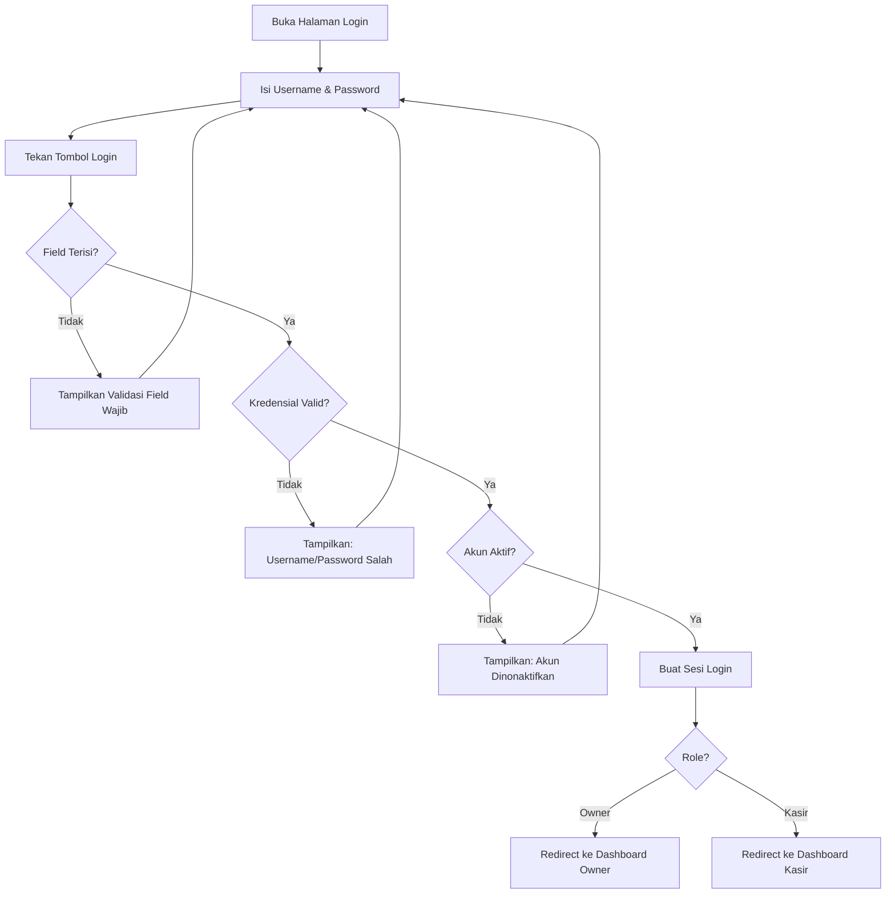
```mermaid
flowchart TD
    A[Buka Halaman Login] --> B[Isi Username & Password]
    B --> C[Tekan Tombol Login]
    C --> D{Field Terisi?}
    D -->|Tidak| E[Tampilkan Validasi Field Wajib]
    E --> B
    D -->|Ya| F{Kredensial Valid?}
    F -->|Tidak| G[Tampilkan: Username/Password Salah]
    G --> B
    F -->|Ya| H{Akun Aktif?}
    H -->|Tidak| I[Tampilkan: Akun Dinonaktifkan]
    I --> B
    H -->|Ya| J[Buat Sesi Login]
    J --> K{Role?}
    K -->|Owner| L[Redirect ke Dashboard Owner]
    K -->|Kasir| M[Redirect ke Dashboard Kasir]
```

#### Decision Flow
Kredensial valid? → YA → Akun aktif? → YA → Masuk Dashboard sesuai role. TIDAK pada salah satu titik → tampilkan pesan error terkait, tetap di halaman Login.

#### System Response
Validasi ganda (frontend untuk UX responsif, backend untuk keamanan); password diverifikasi terhadap hash tersimpan (BR-SEC-001); sesi dibuat dengan mekanisme aman (secure, httpOnly cookie).

#### Success Result
Pengguna berada di Dashboard sesuai role dengan sesi aktif.

#### Failure Result
Pengguna tetap di halaman Login dengan pesan error yang relevan; tidak ada sesi yang dibuat.

---

### FL-AUTH-02 — Role-Based Access Control (RBAC) saat Navigasi

| Field | Detail |
|---|---|
| **Flow ID** | FL-AUTH-02 |
| **Flow Name** | Proteksi Akses Berdasarkan Role |
| **Actor** | Owner, Kasir |
| **Goal** | Sistem membatasi akses menu/aksi sesuai role pengguna |
| **Pre-condition** | Pengguna telah login |
| **Trigger** | Pengguna mengakses suatu menu/aksi/URL |
| **Related Screen** | Seluruh halaman Protected; PG-043 (403) |
| **Business Rules Reference** | BR-ROLE-001 s.d. BR-ROLE-007, BR-SEC-002 |

**Main Flow:**
1. Pengguna mengakses suatu menu, aksi, atau URL langsung.
2. Sistem memeriksa role pengguna terhadap izin akses menu/aksi tersebut (validasi backend, bukan hanya menyembunyikan tombol di frontend).
3. Jika diizinkan, sistem menampilkan/menjalankan aksi.

**Alternative Flow:** Tidak ada — akses hanya dapat diizinkan atau ditolak.

**Exception Flow:**
- **E1 — Akses Ditolak:** Sistem menampilkan halaman "403 - Anda tidak memiliki akses ke halaman ini" dengan opsi kembali ke Dashboard (lihat Bagian 25 — Error Flow).

**Post-condition:** Hanya aksi sesuai izin role yang berhasil dieksekusi; percobaan akses tidak sah ditolak konsisten di seluruh sistem.

---

## 9. DASHBOARD FLOW

### FL-DASH-01 — Melihat Dashboard Owner

| Field | Detail |
|---|---|
| **Flow ID** | FL-DASH-01 |
| **Flow Name** | Melihat Dashboard Owner |
| **Actor** | Owner |
| **Goal** | Owner memperoleh gambaran umum kondisi bisnis hari berjalan |
| **Pre-condition** | Owner telah login |
| **Trigger** | Owner login (redirect otomatis) atau mengklik sidebar "Dashboard" |
| **Related Screen** | SCR-002 |
| **Business Rules Reference** | BR-DASH-001, BR-DASH-002, BR-DASH-004 |

**Main Flow:**
1. Owner tiba di halaman Dashboard.
2. Sistem menampilkan skeleton loading pada kartu ringkasan dan grafik.
3. Sistem mengambil data agregat: Penjualan Hari Ini, Keuntungan Hari Ini, Jumlah Transaksi, Barang Terjual.
4. Sistem menampilkan grafik tren penjualan (minimal 7 hari terakhir).
5. Sistem menampilkan daftar Barang Hampir Habis (stok ≤ ambang batas).
6. Sistem menampilkan ringkasan Hutang Belum Lunas (total nominal & jumlah pelanggan).

**Alternative Flow:**
- **A1 — Klik Kartu "Barang Hampir Habis":** Owner diarahkan ke Data Barang (Cross Navigation, lihat 04_Information_Architecture.md Bagian 14.1).
- **A2 — Klik Kartu "Hutang Belum Lunas":** Owner diarahkan ke Hutang Pelanggan (Cross Navigation, Bagian 14.2).

**Exception Flow:**
- **E1 — Belum Ada Transaksi Hari Ini:** Sistem menampilkan nilai 0/kosong dengan pesan "Belum ada transaksi hari ini" beserta tombol "Mulai Transaksi" menuju Kasir.
- **E2 — Tidak Ada Barang Hampir Habis:** Sistem menampilkan pesan "Semua stok barang aman".
- **E3 — Tidak Ada Hutang Belum Lunas:** Sistem menampilkan pesan "Tidak ada hutang yang belum lunas".

**Post-condition:** Owner memperoleh gambaran umum kondisi bisnis hari berjalan.

#### Decision Flow
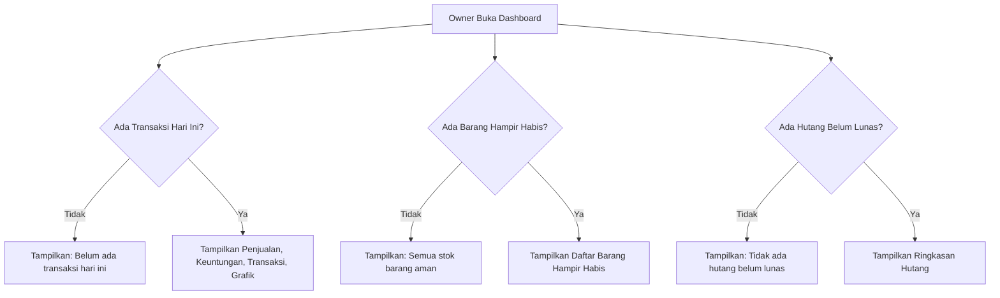
```mermaid
flowchart TD
    A[Owner Buka Dashboard] --> B{Ada Transaksi Hari Ini?}
    B -->|Tidak| C[Tampilkan: Belum ada transaksi hari ini]
    B -->|Ya| D[Tampilkan Penjualan, Keuntungan, Transaksi, Grafik]
    A --> E{Ada Barang Hampir Habis?}
    E -->|Tidak| F[Tampilkan: Semua stok barang aman]
    E -->|Ya| G[Tampilkan Daftar Barang Hampir Habis]
    A --> H{Ada Hutang Belum Lunas?}
    H -->|Tidak| I[Tampilkan: Tidak ada hutang belum lunas]
    H -->|Ya| J[Tampilkan Ringkasan Hutang]
```

#### Success Result
Owner melihat ringkasan finansial dan operasional lengkap hari berjalan.

---

### FL-DASH-02 — Melihat Dashboard Kasir

| Field | Detail |
|---|---|
| **Flow ID** | FL-DASH-02 |
| **Flow Name** | Melihat Dashboard Kasir |
| **Actor** | Kasir |
| **Goal** | Kasir mendapatkan gambaran kondisi operasional harian tanpa data keuntungan |
| **Pre-condition** | Kasir telah login |
| **Trigger** | Kasir login (redirect otomatis) atau mengklik sidebar "Dashboard" |
| **Related Screen** | SCR-003 |
| **Business Rules Reference** | BR-DASH-001, BR-DASH-003, BR-DASH-004 |

**Main Flow:**
1. Kasir tiba di halaman Dashboard.
2. Sistem menampilkan ringkasan jumlah transaksi hari ini.
3. Sistem menampilkan daftar Barang Hampir Habis.
4. Sistem menampilkan ringkasan Hutang Pelanggan (belum lunas).

**Alternative Flow:**
- **A1 — Klik Kartu "Barang Hampir Habis":** Kasir diarahkan ke Data Barang (Read Only).
- **A2 — Klik Kartu "Hutang Pelanggan":** Kasir diarahkan ke Hutang Pelanggan.

**Exception Flow:**
- **E1 — Tidak Ada Transaksi:** Sistem menampilkan pesan "Belum ada transaksi hari ini".

**Post-condition:** Kasir mendapatkan gambaran operasional harian tanpa mengetahui data keuntungan toko (nominal Keuntungan Hari Ini tidak ditampilkan sama sekali — BR-DASH-003).

**Role Differences:** Dashboard Kasir **tidak menampilkan** nominal Keuntungan Hari Ini maupun data finansial sensitif lainnya, berbeda dari Dashboard Owner.

---

## 10. DATA BARANG FLOW

### FL-BRG-00 — Navigasi Umum Data Barang

| Field | Detail |
|---|---|
| **Flow ID** | FL-BRG-00 |
| **Flow Name** | Menelusuri Data Barang (Drill-Down) |
| **Actor** | Owner (Full Access), Kasir (Read Only) |
| **Goal** | Pengguna menemukan informasi kategori dan barang secara berjenjang |
| **Pre-condition** | Pengguna telah login |
| **Trigger** | Klik sidebar "Data Barang" atau Cross Navigation dari Dashboard |
| **Related Screen** | SCR-004, SCR-005, SCR-007, SCR-008 |
| **Business Rules Reference** | BR-BRG-013, BR-ROLE-003 |

**Main Flow (Happy Path — Drill Down):**
1. Pengguna membuka menu "Data Barang" → sistem menampilkan **Daftar Kategori** (landing page).
2. Pengguna memilih satu kategori → sistem menampilkan **Detail Kategori** beserta daftar barang di dalamnya (embedded).
3. Pengguna memilih satu barang → sistem menampilkan **Detail Barang** (nama, foto, harga modal, harga jual, stok, status).

**Alternative Flow:**
- **A1 — Pencarian/Filter:** Pengguna dapat mencari/memfilter barang berdasarkan nama dan kategori pada setiap tingkat daftar.

**Exception Flow:**
- **E1 — Belum Ada Kategori:** Sistem menampilkan "Belum ada kategori. Silakan buat kategori terlebih dahulu" dengan tombol "Tambah Kategori" (Owner only).
- **E2 — Belum Ada Barang dalam Kategori:** Sistem menampilkan "Belum ada barang di kategori ini" dengan tombol "Tambah Barang" (Owner only).
- **E3 — Kasir Mencoba Akses Form Edit via URL:** Sistem menampilkan 403.

**Post-condition:** Pengguna memperoleh informasi barang yang akurat dan terkini.

**Role Differences:** Owner melihat tombol aksi Tambah/Edit/Nonaktifkan pada setiap tingkat; Kasir hanya melihat data tanpa tombol aksi apa pun (Read Only).

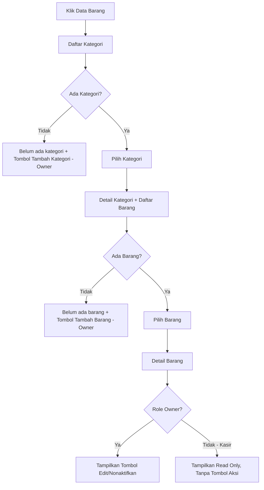
```mermaid
flowchart TD
    A[Klik Data Barang] --> B[Daftar Kategori]
    B --> C{Ada Kategori?}
    C -->|Tidak| D[Belum ada kategori + Tombol Tambah Kategori - Owner]
    C -->|Ya| E[Pilih Kategori]
    E --> F[Detail Kategori + Daftar Barang]
    F --> G{Ada Barang?}
    G -->|Tidak| H[Belum ada barang + Tombol Tambah Barang - Owner]
    G -->|Ya| I[Pilih Barang]
    I --> J[Detail Barang]
    J --> K{Role Owner?}
    K -->|Ya| L[Tampilkan Tombol Edit/Nonaktifkan]
    K -->|Tidak - Kasir| M[Tampilkan Read Only, Tanpa Tombol Aksi]
```

---

## 11. KATEGORI FLOW

### FL-KAT-01 — Tambah Kategori

| Field | Detail |
|---|---|
| **Flow ID** | FL-KAT-01 |
| **Flow Name** | Tambah Kategori Barang |
| **Actor** | Owner |
| **Goal** | Owner membuat kategori baru sebagai wadah pengelompokan barang |
| **Pre-condition** | Owner telah login sebagai Owner |
| **Trigger** | Owner menekan tombol "Tambah Kategori" pada Daftar Kategori |
| **Related Screen** | SCR-006 (Modal) |
| **Business Rules Reference** | BR-KAT-001, BR-KAT-002, BR-VAL-002 |

**Main Flow:**
1. Owner membuka Data Barang → Kategori Barang.
2. Owner menekan tombol "Tambah Kategori".
3. Sistem menampilkan modal form Tambah Kategori.
4. Owner mengisi Nama Kategori.
5. Owner menekan "Simpan".
6. Sistem memvalidasi keunikan nama kategori (case-insensitive).
7. Sistem menyimpan kategori baru dan menampilkannya pada daftar kategori.

**Alternative Flow:**
- **A1 — Batal:** Owner menutup modal tanpa menyimpan (via tombol "Batal", "X", atau klik overlay); jika sudah ada input, sistem menampilkan Unsaved Changes Confirmation.

**Exception Flow:**
- **E1 — Nama Kategori Duplikat:** Sistem menampilkan "Nama kategori sudah digunakan" dan menolak penyimpanan.
- **E2 — Field Kosong:** Sistem menampilkan validasi "Nama kategori wajib diisi".

**Post-condition:** Kategori baru tersimpan dan langsung tersedia sebagai pilihan saat membuat Barang.

#### System Response
Modal ditutup otomatis setelah simpan berhasil; daftar kategori diperbarui secara real-time tanpa reload halaman penuh.

#### Success Result
Kategori baru muncul di Daftar Kategori dan tersedia sebagai opsi pada Form Tambah Barang.

#### Failure Result
Modal tetap terbuka dengan pesan error pada field terkait; data belum tersimpan.

---

### FL-KAT-02 — Edit Kategori

| Field | Detail |
|---|---|
| **Flow ID** | FL-KAT-02 |
| **Flow Name** | Edit Kategori Barang |
| **Actor** | Owner |
| **Goal** | Owner mengubah nama kategori yang sudah ada |
| **Pre-condition** | Kategori telah dibuat sebelumnya |
| **Trigger** | Owner menekan ikon "Edit" pada Daftar/Detail Kategori |
| **Related Screen** | SCR-006 (Modal) |
| **Business Rules Reference** | BR-KAT-001, BR-BRG-011 |

**Main Flow:**
1. Owner membuka Daftar Kategori.
2. Owner memilih kategori dan menekan "Edit".
3. Sistem menampilkan modal berisi nama kategori saat ini.
4. Owner mengubah nama kategori dan menekan "Simpan".
5. Sistem memvalidasi keunikan nama baru.
6. Sistem memperbarui data kategori.

**Alternative Flow:** Tidak ada perubahan → Owner menutup modal tanpa menyimpan.

**Exception Flow:**
- **E1 — Nama Baru Duplikat:** Sistem menolak dan menampilkan pesan "Nama kategori sudah digunakan".

**Post-condition:** Data kategori diperbarui; nama kategori pada barang terkait ikut mencerminkan perubahan.

---

### FL-KAT-03 — Nonaktifkan Kategori

| Field | Detail |
|---|---|
| **Flow ID** | FL-KAT-03 |
| **Flow Name** | Nonaktifkan Kategori |
| **Actor** | Owner |
| **Goal** | Owner menonaktifkan kategori yang sudah tidak digunakan |
| **Pre-condition** | Kategori berstatus aktif |
| **Trigger** | Owner menekan tombol "Nonaktifkan" pada Detail Kategori |
| **Related Screen** | SCR-005 |
| **Business Rules Reference** | BR-KAT-003 |

**Main Flow:**
1. Owner membuka Detail Kategori.
2. Owner menekan tombol "Nonaktifkan".
3. Sistem menampilkan modal konfirmasi.
4. Owner mengonfirmasi.
5. Sistem mengubah status kategori menjadi nonaktif.

**Alternative Flow:**
- **A1 — Batal Konfirmasi:** Owner menekan "Batal" pada modal; status kategori tidak berubah.

**Exception Flow:**
- **E1 — Kategori Masih Memiliki Barang Aktif:** Sistem tetap mengizinkan namun menampilkan peringatan bahwa barang di dalamnya juga tidak dapat dijual, dan meminta konfirmasi tambahan.

**Post-condition:** Kategori nonaktif tidak muncul sebagai pilihan saat menambah Barang baru; barang di dalamnya tetap tersimpan namun mengikuti aturan barang nonaktif.

---

## 12. BARANG FLOW

### FL-BRG-01 — Tambah Barang

| Field | Detail |
|---|---|
| **Flow ID** | FL-BRG-01 |
| **Flow Name** | Tambah Barang Baru |
| **Actor** | Owner |
| **Goal** | Owner menambahkan barang baru ke dalam kategori |
| **Pre-condition** | Minimal terdapat satu kategori aktif |
| **Trigger** | Owner menekan tombol "Tambah Barang" |
| **Related Screen** | SCR-009 |
| **Business Rules Reference** | BR-BRG-001, BR-BRG-002, BR-BRG-003, BR-BRG-004, BR-BRG-005, BR-VAL-003 |

**Main Flow:**
1. Owner membuka menu Data Barang, memilih kategori tujuan.
2. Owner menekan tombol "Tambah Barang".
3. Owner memilih Kategori (jika belum otomatis terisi dari konteks).
4. Owner mengisi Nama Barang, Harga Modal, Harga Jual, Stok Awal.
5. Owner mengunggah Foto Produk (opsional).
6. Owner menekan "Simpan".
7. Sistem memvalidasi: nama unik, harga jual ≥ harga modal, stok ≥ 0.
8. Sistem menyimpan barang dan menghitung margin keuntungan per unit otomatis.

**Alternative Flow:**
- **A1 — Tanpa Foto:** Sistem menggunakan foto placeholder default.
- **A2 — Batal:** Owner menutup form tanpa menyimpan; jika ada input, muncul Unsaved Changes Confirmation.

**Exception Flow:**
- **E1 — Nama Barang Duplikat:** Sistem menolak dan menampilkan pesan error.
- **E2 — Harga Jual < Harga Modal:** Sistem menolak dengan pesan "Harga jual tidak boleh lebih kecil dari harga modal".
- **E3 — Kategori Belum Ada:** Sistem menampilkan "Silakan buat kategori terlebih dahulu" dan mengarahkan ke halaman Kategori.

**Post-condition:** Barang baru tersimpan dan langsung tersedia untuk dijual di modul Kasir.

#### Decision Flow
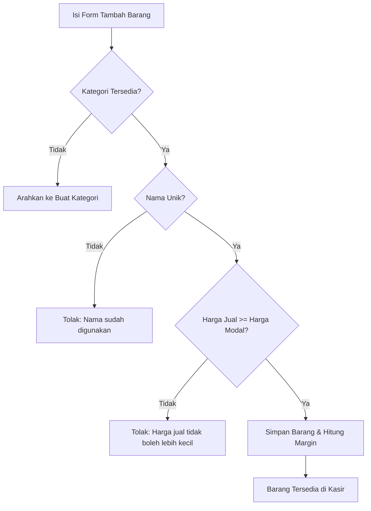
```mermaid
flowchart TD
    A[Isi Form Tambah Barang] --> B{Kategori Tersedia?}
    B -->|Tidak| C[Arahkan ke Buat Kategori]
    B -->|Ya| D{Nama Unik?}
    D -->|Tidak| E[Tolak: Nama sudah digunakan]
    D -->|Ya| F{Harga Jual >= Harga Modal?}
    F -->|Tidak| G[Tolak: Harga jual tidak boleh lebih kecil]
    F -->|Ya| H[Simpan Barang & Hitung Margin]
    H --> I[Barang Tersedia di Kasir]
```

---

### FL-BRG-02 — Edit Barang

| Field | Detail |
|---|---|
| **Flow ID** | FL-BRG-02 |
| **Flow Name** | Edit Data Barang |
| **Actor** | Owner |
| **Goal** | Owner mengubah data barang tanpa memengaruhi histori transaksi |
| **Pre-condition** | Barang sudah ada dalam sistem |
| **Trigger** | Owner menekan tombol "Edit" pada Detail Barang |
| **Related Screen** | SCR-010 |
| **Business Rules Reference** | BR-BRG-003, BR-BRG-011, BR-BRG-012 |

**Main Flow:**
1. Owner membuka Detail Barang, menekan "Edit".
2. Owner mengubah field yang diperlukan (nama, kategori, harga modal, harga jual, foto).
3. Owner menekan "Simpan".
4. Sistem memvalidasi ulang (nama unik, harga jual ≥ harga modal).
5. Sistem memperbarui data barang.

**Alternative Flow:** Tidak ada perubahan → Owner membatalkan edit.

**Exception Flow:**
- **E1 — Validasi Gagal:** Sistem menampilkan pesan error sesuai dan tidak menyimpan perubahan.

**Post-condition:** Data barang diperbarui; histori transaksi sebelumnya **tidak berubah** karena harga tersimpan sebagai snapshot pada level transaksi (BR-BRG-011, BR-BRG-012).

---

### FL-BRG-03 — Nonaktifkan Barang

| Field | Detail |
|---|---|
| **Flow ID** | FL-BRG-03 |
| **Flow Name** | Nonaktifkan/Aktifkan Kembali Barang |
| **Actor** | Owner |
| **Goal** | Owner menghentikan penjualan barang tanpa menghapus datanya |
| **Pre-condition** | Barang sudah ada dalam sistem |
| **Trigger** | Owner menekan tombol "Nonaktifkan" pada Detail Barang |
| **Related Screen** | PG-039 (Modal Konfirmasi) |
| **Business Rules Reference** | BR-BRG-008, BR-BRG-009 |

**Main Flow:**
1. Owner membuka Detail Barang, menekan "Nonaktifkan".
2. Sistem menampilkan modal konfirmasi.
3. Owner mengonfirmasi.
4. Sistem mengubah status barang menjadi nonaktif.

**Alternative Flow:**
- **A1 — Aktifkan Kembali:** Owner menekan "Aktifkan" untuk mengembalikan status barang menjadi aktif.
- **A2 — Batal Konfirmasi:** Status barang tidak berubah.

**Post-condition:** Barang berstatus nonaktif tetap tampil pada Data Barang dengan badge "Nonaktif", namun tidak muncul/tidak dapat dipilih pada pencarian barang di modul Kasir.

---

### FL-BRG-04 — Melihat Data Barang (Read Only — Kasir)

| Field | Detail |
|---|---|
| **Flow ID** | FL-BRG-04 |
| **Flow Name** | Melihat Daftar dan Detail Barang (Read Only) |
| **Actor** | Kasir |
| **Goal** | Kasir memperoleh informasi barang yang akurat tanpa hak ubah |
| **Pre-condition** | Kasir telah login |
| **Trigger** | Kasir membuka menu Data Barang |
| **Related Screen** | SCR-004, SCR-005, SCR-007, SCR-008 |
| **Business Rules Reference** | BR-BRG-013, BR-ROLE-003 |

**Main Flow:**
1. Kasir membuka menu Data Barang.
2. Sistem menampilkan daftar kategori & barang dengan filter/pencarian, tanpa tombol Tambah/Edit/Nonaktifkan/Hapus.
3. Kasir dapat melihat detail masing-masing barang.

**Exception Flow:**
- **E1 — Kasir Mengakses Form Edit via URL Langsung:** Sistem menolak dengan pesan 403.

**Post-condition:** Kasir memperoleh informasi barang terkini untuk membantu pelayanan pelanggan.

---

## 13. KASIR FLOW

### FL-KSR-01 — Cari Barang untuk Transaksi

| Field | Detail |
|---|---|
| **Flow ID** | FL-KSR-01 |
| **Flow Name** | Pencarian Barang Berbasis Nama |
| **Actor** | Owner, Kasir |
| **Goal** | Pengguna menemukan barang yang akan dijual tanpa barcode scanner |
| **Pre-condition** | Pengguna berada pada halaman Kasir |
| **Trigger** | Pengguna mengetik nama barang pada kolom pencarian |
| **Related Screen** | SCR-011 |
| **Business Rules Reference** | BR-KSR-001, BR-KSR-002, BR-GEN-001 |

**Main Flow:**
1. Pengguna mengetik nama (atau sebagian nama) barang pada kolom pencarian.
2. Sistem menampilkan hasil pencarian secara real-time (live search), case-insensitive, partial match.
3. Pengguna memilih barang dari hasil pencarian.

**Alternative Flow:**
- **A1 — Barang dengan Stok Habis:** Barang tetap muncul pada hasil pencarian dengan penanda "Stok Habis", namun tidak dapat ditambahkan ke keranjang.

**Exception Flow:**
- **E1 — Barang Tidak Ditemukan:** Sistem menampilkan "Barang tidak ditemukan" dengan saran mencoba kata kunci lain.
- **E2 — Barang Nonaktif:** Barang nonaktif tidak muncul sama sekali pada hasil pencarian.

**Post-condition:** Barang yang dipilih siap ditambahkan ke keranjang.

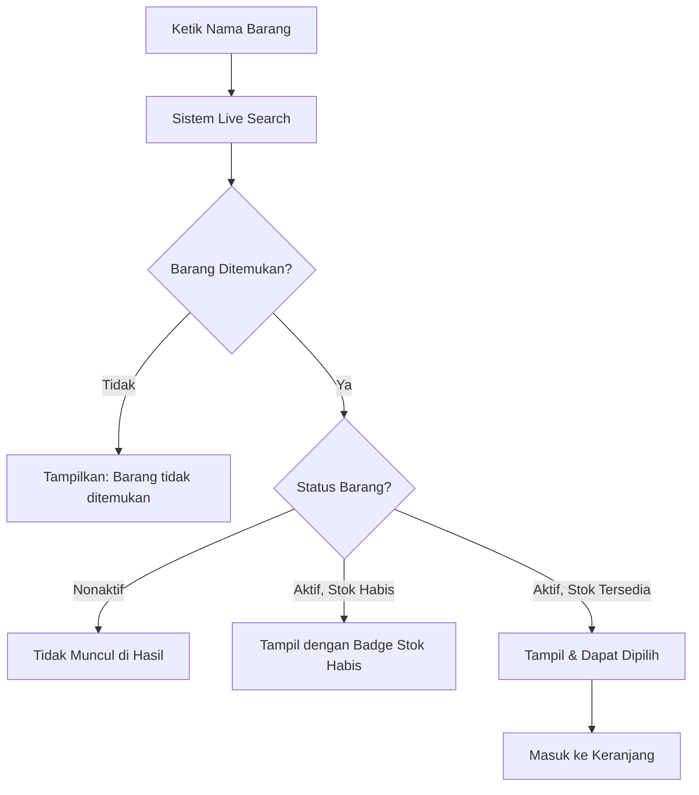
```mermaid
flowchart TD
    A[Ketik Nama Barang] --> B[Sistem Live Search]
    B --> C{Barang Ditemukan?}
    C -->|Tidak| D[Tampilkan: Barang tidak ditemukan]
    C -->|Ya| E{Status Barang?}
    E -->|Nonaktif| F[Tidak Muncul di Hasil]
    E -->|Aktif, Stok Habis| G[Tampil dengan Badge Stok Habis]
    E -->|Aktif, Stok Tersedia| H[Tampil & Dapat Dipilih]
    H --> I[Masuk ke Keranjang]
```

---

## 14. KERANJANG FLOW

### FL-CART-01 — Tambah ke Keranjang

| Field | Detail |
|---|---|
| **Flow ID** | FL-CART-01 |
| **Flow Name** | Menambahkan Barang ke Keranjang |
| **Actor** | Owner, Kasir |
| **Goal** | Barang yang dipilih masuk ke keranjang transaksi |
| **Pre-condition** | Barang berstatus aktif dan stok > 0 |
| **Trigger** | Pengguna memilih barang dari hasil pencarian |
| **Related Screen** | PG-013 (Keranjang, embedded pada SCR-011) |
| **Business Rules Reference** | BR-CART-001, BR-CART-002, BR-CART-003, BR-KSR-02 (FR) |

**Main Flow:**
1. Pengguna memilih barang dari hasil pencarian.
2. Sistem menambahkan barang ke keranjang dengan jumlah default 1.
3. Sistem menampilkan subtotal keranjang secara otomatis (harga jual × jumlah, dijumlahkan seluruh item).

**Alternative Flow:**
- **A1 — Barang Sudah Ada di Keranjang:** Sistem menambahkan jumlah (+1) pada baris yang sama, bukan membuat baris duplikat.

**Exception Flow:**
- **E1 — Stok Tidak Mencukupi:** Sistem menampilkan peringatan dan membatasi jumlah maksimum sesuai stok tersedia.

**Post-condition:** Keranjang berisi barang beserta jumlah dan subtotal terkini; **stok belum berkurang** pada tahap ini (BR-CART-006).

---

### FL-CART-02 — Kurangi/Tambah Jumlah Barang di Keranjang

| Field | Detail |
|---|---|
| **Flow ID** | FL-CART-02 |
| **Flow Name** | Mengubah Jumlah Barang di Keranjang |
| **Actor** | Owner, Kasir |
| **Goal** | Pengguna menyesuaikan jumlah barang sebelum checkout |
| **Pre-condition** | Barang sudah berada dalam keranjang |
| **Trigger** | Pengguna menekan tombol "+" atau "-" pada baris barang |
| **Related Screen** | PG-013 |
| **Business Rules Reference** | BR-CART-003, BR-CART-004, BR-CART-005 |

**Main Flow:**
1. Pengguna menekan "+" untuk menambah, atau "-" untuk mengurangi jumlah.
2. Sistem memvalidasi jumlah terhadap stok tersedia.
3. Sistem memperbarui jumlah dan subtotal keranjang secara real-time.

**Alternative Flow:**
- **A1 — Jumlah Mencapai 0:** Barang otomatis dihapus dari keranjang (lihat FL-CART-03).

**Exception Flow:**
- **E1 — Melebihi Stok:** Sistem menolak penambahan lebih lanjut dan menampilkan "Stok tidak mencukupi".

**Post-condition:** Keranjang mencerminkan jumlah terbaru; stok aktual tidak terpengaruh (BR-CART-005).

---

### FL-CART-03 — Hapus Barang dari Keranjang

| Field | Detail |
|---|---|
| **Flow ID** | FL-CART-03 |
| **Flow Name** | Menghapus Barang dari Keranjang |
| **Actor** | Owner, Kasir |
| **Goal** | Pengguna membatalkan pembelian satu jenis barang sebelum checkout |
| **Pre-condition** | Barang berada dalam keranjang |
| **Trigger** | Pengguna menekan "-" hingga jumlah 0, atau tombol "Hapus" langsung |
| **Related Screen** | PG-013 |
| **Business Rules Reference** | BR-CART-004 |

**Main Flow:**
1. Pengguna menekan tombol "Hapus" pada baris barang (atau mengurangi jumlah hingga 0).
2. Sistem menampilkan konfirmasi singkat (tergantung UI Design).
3. Sistem menghapus baris barang dari keranjang dan memperbarui subtotal.

**Post-condition:** Barang tidak lagi tampil di keranjang; subtotal diperbarui.

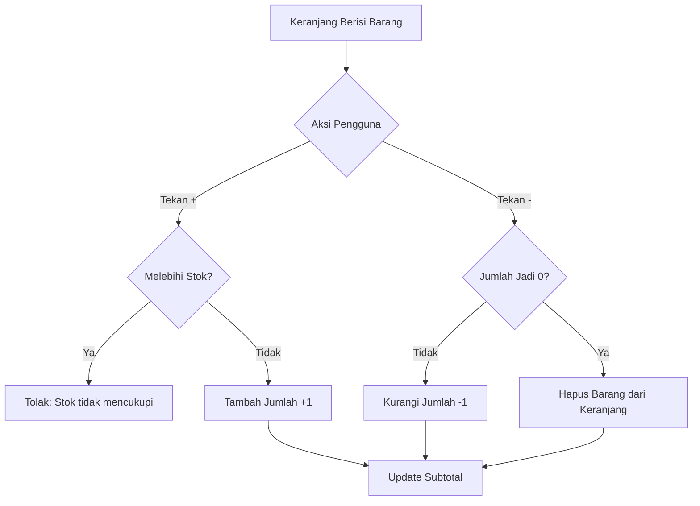
```mermaid
flowchart TD
    A[Keranjang Berisi Barang] --> B{Aksi Pengguna}
    B -->|Tekan +| C{Melebihi Stok?}
    C -->|Ya| D[Tolak: Stok tidak mencukupi]
    C -->|Tidak| E[Tambah Jumlah +1]
    B -->|Tekan -| F{Jumlah Jadi 0?}
    F -->|Ya| G[Hapus Barang dari Keranjang]
    F -->|Tidak| H[Kurangi Jumlah -1]
    E --> I[Update Subtotal]
    H --> I
    G --> I
```

---

## 15. CHECKOUT FLOW

### FL-CHK-01 — Checkout Transaksi

| Field | Detail |
|---|---|
| **Flow ID** | FL-CHK-01 |
| **Flow Name** | Proses Checkout / Penyelesaian Transaksi |
| **Actor** | Owner, Kasir |
| **Goal** | Menyelesaikan transaksi penjualan dan mengubah keranjang menjadi transaksi permanen |
| **Pre-condition** | Keranjang berisi minimal satu barang; seluruh item memiliki stok mencukupi |
| **Trigger** | Pengguna menekan tombol "Checkout" dari halaman Keranjang |
| **Related Screen** | SCR-012, SCR-015 |
| **Business Rules Reference** | BR-CHK-001 s.d. BR-CHK-007, BR-STK-002, BR-STK-003, BR-GEN-004 |

**Main Flow:**
1. Pengguna menekan tombol "Checkout".
2. Sistem menampilkan ringkasan total transaksi.
3. Pengguna memilih metode pembayaran (Cash, QRIS, Hutang, atau Cash + Hutang — lihat Bagian 16, 17, 18).
4. Pengguna menekan tombol "Selesaikan Transaksi".
5. Tombol berubah menjadi status loading (disabled + spinner) untuk mencegah submit ganda.
6. Sistem memvalidasi ulang ketersediaan stok seluruh item pada keranjang.
7. Sistem mengurangi stok barang sesuai jumlah pada transaksi (dalam satu database transaction/atomic).
8. Sistem menyimpan data transaksi beserta detail item dan metode pembayaran.
9. Sistem menghitung keuntungan transaksi berdasarkan harga modal & harga jual **saat transaksi terjadi**.
10. Jika metode melibatkan Hutang, sistem otomatis membuat/menambahkan catatan hutang pada modul Hutang Pelanggan.
11. Sistem mengosongkan keranjang dan menampilkan Struk Transaksi.

**Alternative Flow:**
- **A1 — Metode Hutang Tanpa Pelanggan Terdaftar:** Sistem mewajibkan memilih pelanggan yang ada atau menambahkan pelanggan baru sebelum transaksi dapat diselesaikan (lihat FL-HTG-01).
- **A2 — Pembatalan Checkout:** Pengguna membatalkan sebelum menekan "Selesaikan Transaksi"; keranjang tetap tersimpan/tidak hilang.

**Exception Flow:**
- **E1 — Stok Berubah Sebelum Checkout Final (Race Condition):** Sistem menampilkan "Stok tidak mencukupi untuk [Nama Barang]" dan membatalkan proses checkout tanpa mengurangi stok maupun menyimpan transaksi; keranjang tidak hilang.
- **E2 — Nominal Cash Kurang dari Total (tanpa Hutang):** Sistem menampilkan validasi bahwa nominal cash tidak mencukupi dan meminta pengguna memilih skema Cash + Hutang atau menambah nominal.

**Post-condition:**
1. Stok barang berkurang sesuai jumlah terjual.
2. Transaksi tersimpan permanen.
3. Keuntungan transaksi terhitung dan tersimpan.
4. Keranjang kembali kosong.
5. Hutang baru tercatat (jika berlaku).

#### User Journey
Kasir menyelesaikan transaksi pelanggan → memilih metode bayar → mengonfirmasi → menerima struk → siap melayani pelanggan berikutnya dalam waktu sesingkat mungkin.

#### Activity Flow
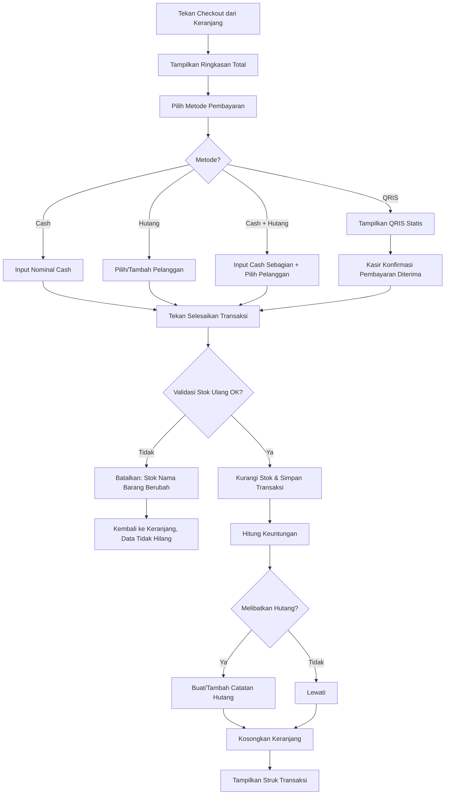
```mermaid
flowchart TD
    A[Tekan Checkout dari Keranjang] --> B[Tampilkan Ringkasan Total]
    B --> C[Pilih Metode Pembayaran]
    C --> D{Metode?}
    D -->|Cash| E[Input Nominal Cash]
    D -->|QRIS| F[Tampilkan QRIS Statis]
    D -->|Hutang| G[Pilih/Tambah Pelanggan]
    D -->|Cash + Hutang| H[Input Cash Sebagian + Pilih Pelanggan]
    E --> I[Tekan Selesaikan Transaksi]
    F --> J[Kasir Konfirmasi Pembayaran Diterima]
    G --> I
    H --> I
    J --> I
    I --> K{Validasi Stok Ulang OK?}
    K -->|Tidak| L[Batalkan: Stok Nama Barang Berubah]
    L --> M[Kembali ke Keranjang, Data Tidak Hilang]
    K -->|Ya| N[Kurangi Stok & Simpan Transaksi]
    N --> O[Hitung Keuntungan]
    O --> P{Melibatkan Hutang?}
    P -->|Ya| Q[Buat/Tambah Catatan Hutang]
    P -->|Tidak| R[Lewati]
    Q --> S[Kosongkan Keranjang]
    R --> S
    S --> T[Tampilkan Struk Transaksi]
```

#### Decision Flow
Stok mencukupi saat checkout final? → TIDAK → batalkan proses, keranjang tetap ada, tampilkan pesan stok berubah. → YA → lanjutkan kurangi stok, simpan transaksi, hitung keuntungan, buat hutang jika berlaku, tampilkan struk.

#### System Response
Seluruh langkah (pengurangan stok, penyimpanan transaksi, pembuatan hutang) dieksekusi dalam satu database transaction (atomic) — jika salah satu langkah gagal, seluruhnya dibatalkan/rollback (BR-GEN-004).

#### Success Result
Transaksi tersimpan, stok berkurang, struk ditampilkan, keranjang kosong dan siap untuk transaksi baru.

#### Failure Result
Transaksi tidak tersimpan, stok tidak berubah, keranjang tetap berisi data pengguna, pesan error ditampilkan.

---

### FL-CHK-02 — Struk Transaksi

| Field | Detail |
|---|---|
| **Flow ID** | FL-CHK-02 |
| **Flow Name** | Generate & Tampilkan Struk Transaksi |
| **Actor** | Owner, Kasir |
| **Goal** | Pengguna memperoleh bukti transaksi |
| **Pre-condition** | Transaksi telah berhasil diselesaikan |
| **Trigger** | Checkout berhasil (otomatis) |
| **Related Screen** | SCR-015 |
| **Business Rules Reference** | BR-CHK-007 |

**Main Flow:**
1. Sistem menampilkan halaman/modal Struk berisi: nama toko, tanggal/waktu, daftar barang, jumlah, harga, total, metode pembayaran, kembalian (jika cash).
2. Pengguna dapat menekan tombol "Cetak" (jika printer tersedia) atau menutup struk untuk kembali ke halaman Kasir (keranjang kosong, siap transaksi baru).

**Alternative Flow:**
- **A1 — Tidak Ada Printer:** Struk tetap ditampilkan pada layar sebagai representasi digital; cetak fisik bersifat opsional (bukan wajib pada versi ini).

**Post-condition:** Pengguna memperoleh bukti transaksi; navigasi kembali ke Kasir untuk transaksi baru.

---

## 16. PEMBAYARAN FLOW

### FL-PAY-01 — Pembayaran Cash

| Field | Detail |
|---|---|
| **Flow ID** | FL-PAY-01 |
| **Flow Name** | Pembayaran Metode Cash |
| **Actor** | Owner, Kasir |
| **Goal** | Menyelesaikan transaksi dengan pembayaran tunai dan menghitung kembalian |
| **Pre-condition** | Pengguna berada pada layar Checkout |
| **Trigger** | Pengguna memilih metode pembayaran "Cash" |
| **Related Screen** | SCR-012 |
| **Business Rules Reference** | BR-PAY-001, BR-PAY-002, BR-PAY-003, BR-VAL-004 |

**Main Flow:**
1. Pengguna memilih metode "Cash".
2. Pengguna memasukkan jumlah uang tunai diterima.
3. Sistem menghitung kembalian (nominal cash − total transaksi) secara real-time.
4. Pengguna menekan "Selesaikan Transaksi" (lanjut ke FL-CHK-01 langkah 5).

**Exception Flow:**
- **E1 — Nominal Cash Kurang dari Total:** Sistem menampilkan "Nominal pembayaran tidak mencukupi, silakan pilih metode Cash + Hutang atau tambahkan nominal" dan mewajibkan pengguna memilih skema Cash + Hutang atau menambah nominal.

**Post-condition:** Transaksi tercatat sebagai dibayar Cash dengan kembalian yang tertera pada struk.

---

### FL-PAY-02 — Pembayaran Cash + Hutang

| Field | Detail |
|---|---|
| **Flow ID** | FL-PAY-02 |
| **Flow Name** | Pembayaran Kombinasi Cash + Hutang |
| **Actor** | Owner, Kasir |
| **Goal** | Menyelesaikan transaksi ketika pelanggan hanya membayar sebagian secara tunai |
| **Pre-condition** | Pengguna berada pada layar Checkout |
| **Trigger** | Pengguna memilih metode pembayaran "Cash + Hutang" |
| **Related Screen** | SCR-012, SCR-014 |
| **Business Rules Reference** | BR-PAY-004, BR-PAY-005 |

**Main Flow:**
1. Pengguna memilih metode "Cash + Hutang".
2. Pengguna memasukkan nominal cash yang dibayarkan (kurang dari total transaksi).
3. Sistem menghitung sisa nominal yang otomatis menjadi hutang.
4. Pengguna memilih pelanggan terdaftar atau menambahkan pelanggan baru (lihat FL-HTG-01).
5. Pengguna menekan "Selesaikan Transaksi".

**Exception Flow:**
- **E1 — Belum Ada Data Pelanggan:** Sistem mewajibkan pengguna menambahkan pelanggan baru sebelum transaksi dapat diselesaikan.

**Post-condition:** Transaksi tercatat dengan dua komponen pembayaran (Cash + Hutang); sisa nominal otomatis tercatat sebagai hutang atas nama pelanggan yang dipilih.

---

### FL-PAY-03 — Pembayaran Hutang (Checkout)

| Field | Detail |
|---|---|
| **Flow ID** | FL-PAY-03 |
| **Flow Name** | Pembayaran Metode Hutang Penuh |
| **Actor** | Owner, Kasir |
| **Goal** | Mencatat seluruh nominal transaksi sebagai hutang pelanggan |
| **Pre-condition** | Pengguna berada pada layar Checkout |
| **Trigger** | Pengguna memilih metode pembayaran "Hutang" |
| **Related Screen** | SCR-012, SCR-014 |
| **Business Rules Reference** | BR-PAY-004, BR-CHK-005 |

**Main Flow:**
1. Pengguna memilih metode "Hutang".
2. Pengguna memilih/menambahkan data pelanggan.
3. Seluruh nominal transaksi tercatat sebagai hutang atas nama pelanggan tersebut.
4. Pengguna menekan "Selesaikan Transaksi".

**Exception Flow:**
- **E1 — Belum Ada Data Pelanggan:** Sistem mewajibkan menambahkan pelanggan baru terlebih dahulu.

**Post-condition:** Transaksi tersimpan sebagai lunas Rp 0 dari sisi kas toko; hutang baru tercatat penuh pada modul Hutang Pelanggan.

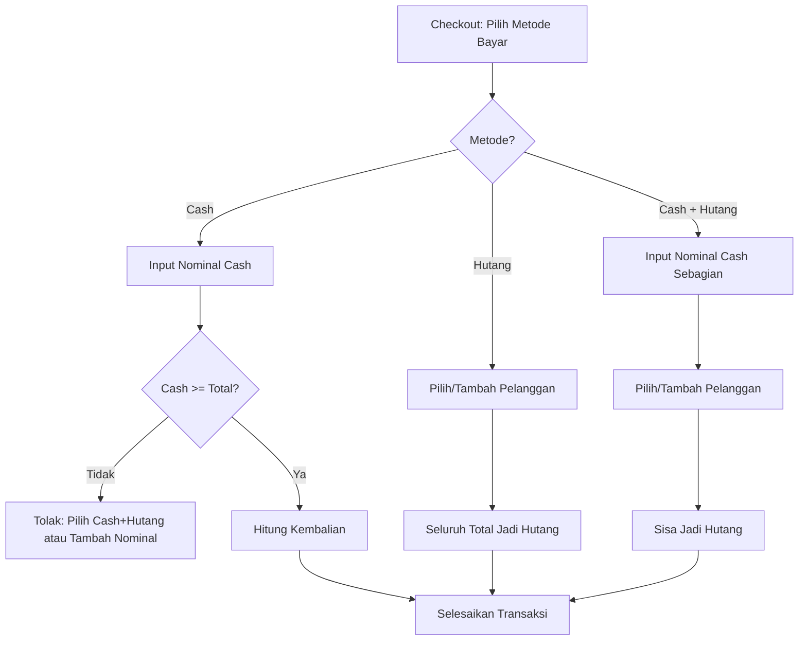
```mermaid
flowchart TD
    A[Checkout: Pilih Metode Bayar] --> B{Metode?}
    B -->|Cash| C[Input Nominal Cash]
    C --> D{Cash >= Total?}
    D -->|Tidak| E[Tolak: Pilih Cash+Hutang atau Tambah Nominal]
    D -->|Ya| F[Hitung Kembalian]
    B -->|Hutang| G[Pilih/Tambah Pelanggan]
    G --> H[Seluruh Total Jadi Hutang]
    B -->|Cash + Hutang| I[Input Nominal Cash Sebagian]
    I --> J[Pilih/Tambah Pelanggan]
    J --> K[Sisa Jadi Hutang]
    F --> L[Selesaikan Transaksi]
    H --> L
    K --> L
```

---

## 17. QRIS FLOW

### FL-QRIS-01 — Pembayaran QRIS Statis

| Field | Detail |
|---|---|
| **Flow ID** | FL-QRIS-01 |
| **Flow Name** | Pembayaran via QRIS Statis |
| **Actor** | Owner, Kasir |
| **Goal** | Menyelesaikan transaksi non-tunai dengan verifikasi manual oleh kasir |
| **Pre-condition** | Owner telah mengunggah gambar QRIS pada Pengaturan |
| **Trigger** | Pengguna memilih metode pembayaran "QRIS" pada Checkout |
| **Related Screen** | SCR-013 |
| **Business Rules Reference** | BR-QRIS-001, BR-QRIS-002, BR-QRIS-003, BR-QRIS-004 |

**Main Flow:**
1. Pengguna memilih metode pembayaran "QRIS".
2. Sistem menampilkan gambar QRIS statis toko beserta total tagihan.
3. Pelanggan memindai dan membayar menggunakan aplikasi pembayaran masing-masing (di luar sistem StoreKuify).
4. Pelanggan menunjukkan bukti pembayaran berhasil kepada kasir.
5. Kasir memeriksa bukti pembayaran secara manual (trust-based).
6. Kasir menekan tombol "Konfirmasi Pembayaran Diterima".
7. Sistem melanjutkan proses penyelesaian transaksi (lihat FL-CHK-01 langkah 5).

**Alternative Flow:**
- **A1 — Pelanggan Batal Membayar QRIS:** Kasir dapat membatalkan pemilihan QRIS dan kembali ke pemilihan metode pembayaran; keranjang tidak hilang.

**Exception Flow:**
- **E1 — QRIS Belum Diatur:** Jika Owner belum mengunggah QRIS, opsi metode pembayaran QRIS tidak ditampilkan/dinonaktifkan pada layar checkout.

**Post-condition:** Transaksi tercatat sebagai dibayar melalui QRIS berdasarkan konfirmasi manual kasir; sistem **tidak** melakukan verifikasi otomatis (bukan integrasi payment gateway).

#### User Journey
Kasir memilih QRIS → menunjukkan QR ke pelanggan → menunggu bukti bayar → mengonfirmasi secara manual → transaksi selesai.

#### Decision Flow
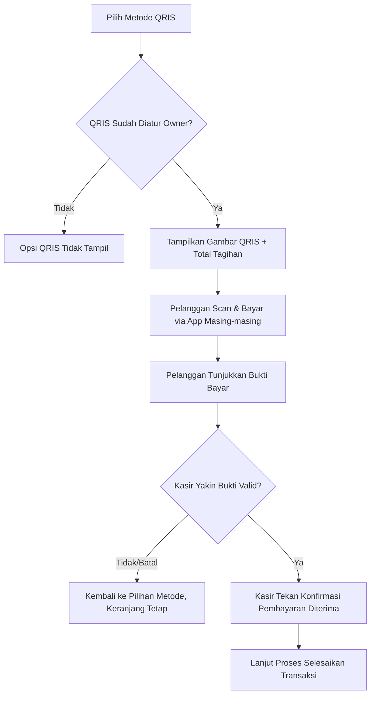
```mermaid
flowchart TD
    A[Pilih Metode QRIS] --> B{QRIS Sudah Diatur Owner?}
    B -->|Tidak| C[Opsi QRIS Tidak Tampil]
    B -->|Ya| D[Tampilkan Gambar QRIS + Total Tagihan]
    D --> E[Pelanggan Scan & Bayar via App Masing-masing]
    E --> F[Pelanggan Tunjukkan Bukti Bayar]
    F --> G{Kasir Yakin Bukti Valid?}
    G -->|Tidak/Batal| H[Kembali ke Pilihan Metode, Keranjang Tetap]
    G -->|Ya| I[Kasir Tekan Konfirmasi Pembayaran Diterima]
    I --> J[Lanjut Proses Selesaikan Transaksi]
```

#### System Response
Sistem tidak menerima callback/webhook otomatis apa pun dari penyedia pembayaran; status "dibayar" murni ditentukan oleh aksi eksplisit kasir menekan tombol konfirmasi (BR-QRIS-002, BR-QRIS-004).

#### Success Result
Transaksi selesai dengan metode QRIS tercatat; struk ditampilkan.

#### Failure Result
Jika kasir membatalkan sebelum konfirmasi, transaksi belum tersimpan dan pengguna kembali memilih metode pembayaran lain.

---

## 18. HUTANG FLOW

### FL-HTG-01 — Tambah Pelanggan

| Field | Detail |
|---|---|
| **Flow ID** | FL-HTG-01 |
| **Flow Name** | Tambah Data Pelanggan Baru |
| **Actor** | Owner, Kasir |
| **Goal** | Menambahkan data pelanggan untuk keperluan pencatatan hutang |
| **Pre-condition** | Pengguna telah login |
| **Trigger** | Pengguna menekan tombol "Tambah Pelanggan" pada Daftar Pelanggan atau saat Checkout metode Hutang/Cash+Hutang |
| **Related Screen** | SCR-014 (Modal) |
| **Business Rules Reference** | BR-HTG-001, BR-VAL-002 |

**Main Flow:**
1. Pengguna membuka menu Hutang Pelanggan (atau berada di tengah proses Checkout).
2. Pengguna menekan tombol "Tambah Pelanggan".
3. Sistem menampilkan modal form: Nama Pelanggan, No. Telepon (opsional).
4. Pengguna mengisi data dan menekan "Simpan".
5. Sistem menyimpan data pelanggan baru.

**Exception Flow:**
- **E1 — Nama Kosong:** Sistem menampilkan validasi "Nama pelanggan wajib diisi".

**Post-condition:** Pelanggan baru langsung tersedia sebagai pilihan pada Daftar Pelanggan maupun checkout metode Hutang.

---

### FL-HTG-02 — Tambah Hutang (via Transaksi)

| Field | Detail |
|---|---|
| **Flow ID** | FL-HTG-02 |
| **Flow Name** | Pembuatan Hutang Otomatis dari Transaksi |
| **Actor** | Owner, Kasir (tidak langsung, sebagai efek dari Checkout) |
| **Goal** | Nominal transaksi yang belum dibayar tunai tercatat sebagai hutang |
| **Pre-condition** | Checkout diselesaikan dengan metode Hutang atau Cash+Hutang |
| **Trigger** | Checkout berhasil dengan metode yang melibatkan Hutang |
| **Related Screen** | SCR-016, SCR-017 |
| **Business Rules Reference** | BR-CHK-005, BR-HTG-001 |

**Main Flow:**
1. Sistem mendeteksi metode pembayaran melibatkan Hutang saat checkout (lihat FL-CHK-01 langkah 10).
2. Sistem membuat/menambahkan catatan hutang baru pada modul Hutang Pelanggan, terhubung dengan pelanggan dan transaksi sumber.
3. Nominal hutang langsung terlihat pada Daftar Pelanggan dan Detail Hutang & Histori Pelanggan.

**Post-condition:** Outstanding hutang pelanggan bertambah sesuai nominal yang belum dibayar tunai.

---

### FL-HTG-03 — Melihat Daftar & Detail Hutang Pelanggan

| Field | Detail |
|---|---|
| **Flow ID** | FL-HTG-03 |
| **Flow Name** | Melihat Daftar Pelanggan dan Histori Hutang |
| **Actor** | Owner, Kasir |
| **Goal** | Pengguna memahami status hutang seluruh/satu pelanggan |
| **Pre-condition** | Terdapat minimal satu data pelanggan |
| **Trigger** | Pengguna membuka menu "Hutang Pelanggan" |
| **Related Screen** | SCR-016, SCR-017 |
| **Business Rules Reference** | BR-HTG-005, BR-HTG-006, BR-AUD-002 |

**Main Flow:**
1. Pengguna membuka menu Hutang Pelanggan.
2. Sistem menampilkan daftar pelanggan beserta total hutang aktif masing-masing.
3. Pengguna mencari pelanggan berdasarkan nama (opsional).
4. Pengguna memilih satu pelanggan.
5. Sistem menampilkan detail: daftar transaksi sumber hutang, nominal masing-masing, tanggal, serta histori pembayaran cicilan/lunas.

**Exception Flow:**
- **E1 — Belum Ada Pelanggan:** Sistem menampilkan "Belum ada pelanggan. Silakan tambah pelanggan terlebih dahulu" dengan tombol "Tambah Pelanggan".
- **E2 — Belum Ada Histori Hutang:** Sistem menampilkan "Belum ada histori hutang untuk pelanggan ini".

**Post-condition:** Pengguna memahami riwayat lengkap hutang pelanggan; histori **tidak dapat dihapus** oleh siapa pun termasuk Owner (BR-HTG-005).

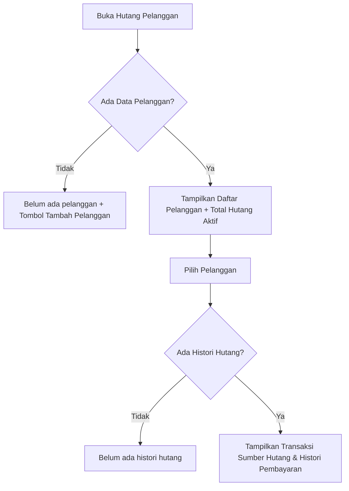
```mermaid
flowchart TD
    A[Buka Hutang Pelanggan] --> B{Ada Data Pelanggan?}
    B -->|Tidak| C[Belum ada pelanggan + Tombol Tambah Pelanggan]
    B -->|Ya| D[Tampilkan Daftar Pelanggan + Total Hutang Aktif]
    D --> E[Pilih Pelanggan]
    E --> F{Ada Histori Hutang?}
    F -->|Tidak| G[Belum ada histori hutang]
    F -->|Ya| H[Tampilkan Transaksi Sumber Hutang & Histori Pembayaran]
```

---

## 19. PEMBAYARAN HUTANG FLOW

### FL-HTG-04 — Pembayaran Sebagian (Cicilan)

| Field | Detail |
|---|---|
| **Flow ID** | FL-HTG-04 |
| **Flow Name** | Terima Pembayaran Hutang — Sebagian (Cicilan) |
| **Actor** | Owner, Kasir |
| **Goal** | Mencatat pembayaran cicilan yang mengurangi outstanding hutang |
| **Pre-condition** | Pelanggan memiliki hutang aktif (outstanding > 0) |
| **Trigger** | Pengguna menekan tombol "Terima Pembayaran" pada Detail Hutang |
| **Related Screen** | SCR-018 |
| **Business Rules Reference** | BR-HTG-002, BR-HTG-004, BR-VAL-005 (Validasi Hutang) |

**Main Flow:**
1. Pengguna membuka Detail Hutang pelanggan.
2. Pengguna menekan tombol "Terima Pembayaran".
3. Sistem menampilkan modal form nominal pembayaran.
4. Pengguna memasukkan nominal pembayaran (lebih kecil dari outstanding).
5. Sistem memvalidasi nominal (harus > 0, tidak melebihi outstanding).
6. Sistem mengurangi nominal hutang outstanding sesuai jumlah dibayarkan.
7. Sistem mencatat histori pembayaran (tanggal, nominal, kasir/owner yang mencatat).

**Exception Flow:**
- **E1 — Nominal Melebihi Outstanding:** Sistem menolak dan menampilkan "Nominal pembayaran melebihi total hutang yang tersisa".

**Post-condition:** Status hutang tetap "Belum Lunas" dengan sisa outstanding yang diperbarui; histori pembayaran tersimpan permanen dan tidak dapat dihapus/diedit (audit-safe).

---

### FL-HTG-05 — Pelunasan Hutang

| Field | Detail |
|---|---|
| **Flow ID** | FL-HTG-05 |
| **Flow Name** | Terima Pembayaran Hutang — Pelunasan Penuh |
| **Actor** | Owner, Kasir |
| **Goal** | Menyelesaikan seluruh kewajiban hutang pelanggan |
| **Pre-condition** | Pelanggan memiliki hutang aktif (outstanding > 0) |
| **Trigger** | Pengguna memasukkan nominal pembayaran yang sama dengan sisa outstanding |
| **Related Screen** | SCR-018 |
| **Business Rules Reference** | BR-HTG-003, BR-HTG-004 |

**Main Flow:**
1. Pengguna membuka Detail Hutang pelanggan, menekan "Terima Pembayaran".
2. Pengguna memasukkan nominal pembayaran sama dengan sisa outstanding.
3. Sistem memvalidasi nominal.
4. Sistem mengurangi outstanding menjadi Rp 0.
5. Sistem otomatis mengubah status hutang menjadi "Lunas".
6. Sistem mencatat histori pembayaran pelunasan.

**Post-condition:** Status pelanggan menjadi "Lunas"; histori tetap tersimpan meskipun seluruh hutang telah lunas (BR-HTG-006).

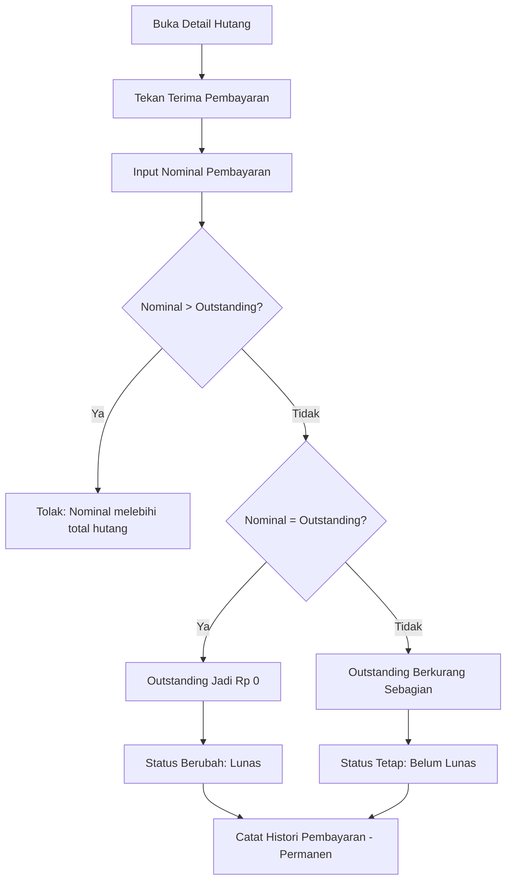
```mermaid
flowchart TD
    A[Buka Detail Hutang] --> B[Tekan Terima Pembayaran]
    B --> C[Input Nominal Pembayaran]
    C --> D{Nominal > Outstanding?}
    D -->|Ya| E[Tolak: Nominal melebihi total hutang]
    D -->|Tidak| F{Nominal = Outstanding?}
    F -->|Ya| G[Outstanding Jadi Rp 0]
    G --> H[Status Berubah: Lunas]
    F -->|Tidak| I[Outstanding Berkurang Sebagian]
    I --> J[Status Tetap: Belum Lunas]
    H --> K[Catat Histori Pembayaran - Permanen]
    J --> K
```

---

## 20. LAPORAN FLOW

### FL-LAP-01 — Melihat Laporan Penjualan

| Field | Detail |
|---|---|
| **Flow ID** | FL-LAP-01 |
| **Flow Name** | Laporan Penjualan Berdasarkan Periode |
| **Actor** | Owner |
| **Goal** | Owner memperoleh data agregat penjualan & keuntungan sesuai periode |
| **Pre-condition** | Terdapat minimal satu transaksi tersimpan |
| **Trigger** | Owner membuka menu "Laporan" |
| **Related Screen** | SCR-019 |
| **Business Rules Reference** | BR-LAP-001, BR-LAP-002, BR-LAP-003, BR-LAP-004 |

**Main Flow:**
1. Owner membuka menu Laporan.
2. Sistem menampilkan tab periode default (Harian) dengan skeleton loading.
3. Sistem menghitung dan menampilkan Total Penjualan, Total Keuntungan, Jumlah Transaksi, Total Barang Terjual.
4. Sistem menampilkan grafik tren penjualan pada periode terpilih.
5. Sistem menampilkan ranking Top Barang Terlaris dan Barang Paling Menguntungkan.

**Alternative Flow:**
- **A1 — Ganti Tab Periode:** Owner mengklik tab "Mingguan"/"Bulanan"/"Tahunan"; hanya konten laporan yang diperbarui, breadcrumb induk tidak berubah (NAV-012).
- **A2 — Klik Barang pada Ranking:** Owner diarahkan ke Detail Barang (Cross Navigation, IA Bagian 14.5).

**Exception Flow:**
- **E1 — Tidak Ada Transaksi pada Periode:** Sistem menampilkan nilai 0 dan pesan "Tidak ada data transaksi pada periode ini".
- **E2 — Data Ranking Kosong:** Sistem menampilkan "Belum ada data untuk periode ini".

**Post-condition:** Owner memperoleh data agregat penjualan sesuai periode yang dipilih; **Total Keuntungan selalu dihitung berdasarkan margin harga saat transaksi terjadi**, bukan harga barang saat ini (BR-LAP-003).

**Role Differences:** Modul Laporan hanya dapat diakses Owner (BR-LAP-001); Kasir yang mengakses via URL langsung menerima 403.

---

### FL-LAP-02 — Filter Laporan Berdasarkan Rentang Tanggal Kustom

| Field | Detail |
|---|---|
| **Flow ID** | FL-LAP-02 |
| **Flow Name** | Filter Tanggal Kustom pada Laporan |
| **Actor** | Owner |
| **Goal** | Owner melihat laporan di luar preset periode standar |
| **Pre-condition** | Owner berada pada halaman Laporan |
| **Trigger** | Owner memilih opsi "Rentang Kustom" |
| **Related Screen** | SCR-019 |
| **Business Rules Reference** | BR-LAP-005 |

**Main Flow:**
1. Owner memilih tab/opsi "Rentang Kustom".
2. Owner memasukkan Tanggal Mulai dan Tanggal Akhir.
3. Owner menekan tombol "Terapkan Filter".
4. Sistem menampilkan data laporan (total penjualan, keuntungan, grafik, ranking barang) sesuai rentang yang dipilih.

**Exception Flow:**
- **E1 — Tanggal Tidak Valid:** Sistem menampilkan validasi error jika Tanggal Mulai > Tanggal Akhir.

**Post-condition:** Laporan menampilkan data sesuai rentang tanggal kustom yang dipilih Owner.

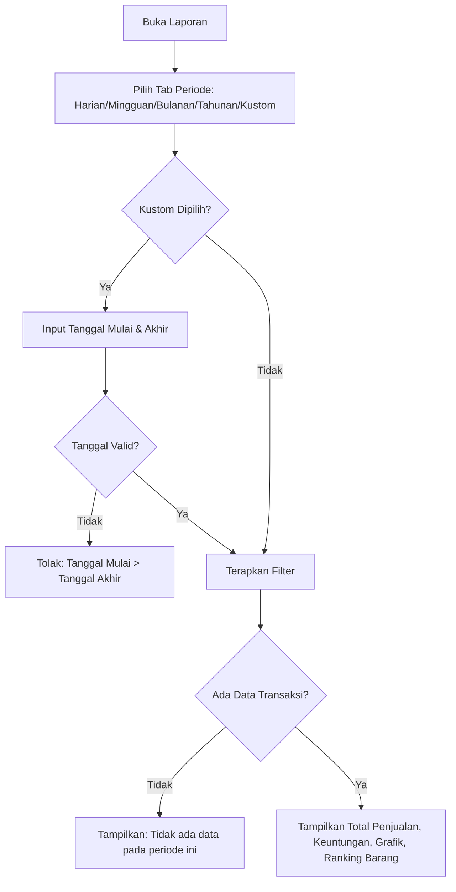
```mermaid
flowchart TD
    A[Buka Laporan] --> B[Pilih Tab Periode: Harian/Mingguan/Bulanan/Tahunan/Kustom]
    B --> C{Kustom Dipilih?}
    C -->|Ya| D[Input Tanggal Mulai & Akhir]
    D --> E{Tanggal Valid?}
    E -->|Tidak| F[Tolak: Tanggal Mulai > Tanggal Akhir]
    E -->|Ya| G[Terapkan Filter]
    C -->|Tidak| G
    G --> H{Ada Data Transaksi?}
    H -->|Tidak| I[Tampilkan: Tidak ada data pada periode ini]
    H -->|Ya| J[Tampilkan Total Penjualan, Keuntungan, Grafik, Ranking Barang]
```

---

## 21. KELOLA KASIR FLOW

### FL-KKS-01 — Tambah Akun Kasir

| Field | Detail |
|---|---|
| **Flow ID** | FL-KKS-01 |
| **Flow Name** | Tambah Akun Kasir Baru |
| **Actor** | Owner |
| **Goal** | Owner membuat akun Kasir baru |
| **Pre-condition** | Owner telah login |
| **Trigger** | Owner menekan tombol "Tambah Kasir" pada Daftar Kasir |
| **Related Screen** | SCR-022 |
| **Business Rules Reference** | BR-KKS-001, BR-KKS-002, BR-AUTH-002, BR-VAL-001 |

**Main Flow:**
1. Owner membuka menu Kelola Kasir → Daftar Kasir.
2. Owner menekan tombol "Tambah Kasir".
3. Owner mengisi Nama, Username, dan Password.
4. Owner menekan "Simpan".
5. Sistem memvalidasi keunikan username (lintas seluruh role, termasuk Owner).
6. Sistem membuat akun Kasir baru dengan role "Kasir" dan status **aktif secara default**.

**Exception Flow:**
- **E1 — Username Sudah Digunakan:** Sistem menolak dengan pesan "Username sudah digunakan".
- **E2 — Field Wajib Kosong:** Sistem menampilkan validasi field wajib diisi.

**Post-condition:** Akun Kasir baru dapat langsung digunakan untuk login.

---

### FL-KKS-02 — Edit Kasir

| Field | Detail |
|---|---|
| **Flow ID** | FL-KKS-02 |
| **Flow Name** | Edit Data Akun Kasir |
| **Actor** | Owner |
| **Goal** | Owner mengubah nama/username akun Kasir |
| **Pre-condition** | Akun Kasir sudah terdaftar |
| **Trigger** | Owner memilih akun Kasir pada Daftar Kasir |
| **Related Screen** | SCR-021 |
| **Business Rules Reference** | BR-KKS-001 |

**Main Flow:**
1. Owner membuka Daftar Kasir, memilih akun Kasir.
2. Owner mengubah data (nama, username) dan menekan "Simpan".
3. Sistem memvalidasi keunikan username baru.
4. Sistem memperbarui data akun.

**Exception Flow:**
- **E1 — Username Baru Duplikat:** Sistem menolak dengan pesan error.

**Post-condition:** Data akun diperbarui; perubahan username tidak memengaruhi histori transaksi (tetap tertaut melalui ID internal).

---

### FL-KKS-03 — Reset Password Kasir

| Field | Detail |
|---|---|
| **Flow ID** | FL-KKS-03 |
| **Flow Name** | Reset Password Akun Kasir oleh Owner |
| **Actor** | Owner |
| **Goal** | Owner mereset password Kasir yang lupa password tanpa mengetahui password lama |
| **Pre-condition** | Akun Kasir terdaftar |
| **Trigger** | Owner menekan tombol "Reset Password" pada Detail Kasir |
| **Related Screen** | SCR-023 |
| **Business Rules Reference** | BR-KKS-005, BR-SEC-001, BR-VAL-001 |

**Main Flow:**
1. Owner membuka Detail Akun Kasir, menekan "Reset Password".
2. Sistem menampilkan modal input password baru.
3. Owner memasukkan password baru.
4. Sistem memvalidasi kriteria minimal password.
5. Sistem menyimpan password baru dalam bentuk hash.

**Exception Flow:**
- **E1 — Password Baru Tidak Memenuhi Kriteria:** Sistem menampilkan validasi kriteria minimal password (minimal 8 karakter).

**Post-condition:** Kasir dapat login menggunakan password baru; password lama sepenuhnya digantikan.

---

### FL-KKS-04 — Nonaktifkan Akun Kasir

| Field | Detail |
|---|---|
| **Flow ID** | FL-KKS-04 |
| **Flow Name** | Nonaktifkan Akun Kasir |
| **Actor** | Owner |
| **Goal** | Owner menghentikan akses Kasir tanpa menghapus data historis |
| **Pre-condition** | Akun Kasir berstatus aktif |
| **Trigger** | Owner menekan tombol "Nonaktifkan" pada Detail Kasir |
| **Related Screen** | PG-031 (Modal Konfirmasi) |
| **Business Rules Reference** | BR-KKS-003, BR-KKS-004 |

**Main Flow:**
1. Owner membuka Detail Akun Kasir, menekan "Nonaktifkan".
2. Sistem menampilkan modal konfirmasi.
3. Owner mengonfirmasi.
4. Sistem mengubah status akun menjadi nonaktif.

**Alternative Flow:**
- **A1 — Aktifkan Kembali:** Owner dapat mengaktifkan kembali akun Kasir yang sebelumnya dinonaktifkan.

**Exception Flow:**
- **E1 — Kasir Sedang Login Saat Dinonaktifkan:** Sesi aktif Kasir tersebut ditolak pada request berikutnya (dipaksa logout otomatis pada akses selanjutnya — lihat FL-SESS-02).

**Post-condition:** Akun Kasir tidak dapat login sampai diaktifkan kembali; histori transaksi akun tersebut tetap tersimpan tanpa terpengaruh.

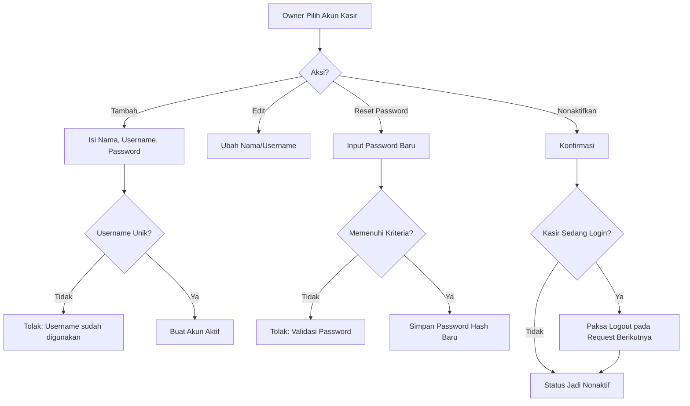
```mermaid
flowchart TD
    A[Owner Pilih Akun Kasir] --> B{Aksi?}
    B -->|Tambah| C[Isi Nama, Username, Password]
    C --> D{Username Unik?}
    D -->|Tidak| E[Tolak: Username sudah digunakan]
    D -->|Ya| F[Buat Akun Aktif]
    B -->|Edit| G[Ubah Nama/Username]
    B -->|Reset Password| H[Input Password Baru]
    H --> I{Memenuhi Kriteria?}
    I -->|Tidak| J[Tolak: Validasi Password]
    I -->|Ya| K[Simpan Password Hash Baru]
    B -->|Nonaktifkan| L[Konfirmasi]
    L --> M{Kasir Sedang Login?}
    M -->|Ya| N[Paksa Logout pada Request Berikutnya]
    M -->|Tidak| O[Status Jadi Nonaktif]
    N --> O
```

---

## 22. PENGATURAN FLOW

### FL-SET-01 — Ubah Profil Toko

| Field | Detail |
|---|---|
| **Flow ID** | FL-SET-01 |
| **Flow Name** | Pengaturan Nama Toko, Alamat, dan Logo |
| **Actor** | Owner |
| **Goal** | Owner memperbarui identitas toko yang tampil di struk dan aplikasi |
| **Pre-condition** | Owner telah login |
| **Trigger** | Owner membuka Pengaturan → tab "Profil Toko" |
| **Related Screen** | SCR-024 |
| **Business Rules Reference** | BR-SET-001, BR-SET-002, BR-VAL-004 |

**Main Flow:**
1. Owner membuka Pengaturan → Profil Toko.
2. Owner mengubah Nama Toko, Alamat Toko, dan/atau mengunggah Logo baru.
3. Owner menekan "Simpan".
4. Sistem memvalidasi data dan menyimpan perubahan.

**Exception Flow:**
- **E1 — Format Logo Tidak Didukung:** Sistem menolak dan menampilkan pesan format file yang didukung (JPG/PNG).
- **E2 — Nama Toko Kosong:** Sistem menampilkan validasi wajib diisi.

**Post-condition:** Data toko diperbarui dan langsung tercermin pada struk transaksi berikutnya (BR-SET-002).

---

### FL-SET-02 — Upload/Kelola QRIS Statis

| Field | Detail |
|---|---|
| **Flow ID** | FL-SET-02 |
| **Flow Name** | Unggah dan Kelola Gambar QRIS Toko |
| **Actor** | Owner |
| **Goal** | Owner menyediakan opsi pembayaran QRIS untuk modul Kasir |
| **Pre-condition** | Owner telah login |
| **Trigger** | Owner membuka Pengaturan → tab "QRIS" |
| **Related Screen** | SCR-025 |
| **Business Rules Reference** | BR-SET-003, BR-QRIS-003, BR-VAL-004 |

**Main Flow:**
1. Owner membuka Pengaturan → QRIS.
2. Owner mengunggah gambar QRIS.
3. Owner menekan "Simpan".
4. Sistem menyimpan gambar QRIS dan mengaktifkan opsi pembayaran QRIS pada modul Kasir tanpa perlu restart sistem.

**Alternative Flow:**
- **A1 — Owner Menghapus QRIS:** Opsi metode pembayaran QRIS otomatis disembunyikan/dinonaktifkan pada modul Kasir hingga QRIS baru diunggah (BR-SET-003).

**Exception Flow:**
- **E1 — Format Tidak Didukung:** Sistem menolak file yang bukan gambar JPG/PNG.

**Post-condition:** Gambar QRIS tersedia sebagai metode pembayaran pada checkout.

---

### FL-SET-03 — Ubah Profil Owner

| Field | Detail |
|---|---|
| **Flow ID** | FL-SET-03 |
| **Flow Name** | Pengaturan Profil Akun Owner |
| **Actor** | Owner |
| **Goal** | Owner memperbarui data profil pribadinya |
| **Pre-condition** | Owner telah login |
| **Trigger** | Owner membuka Pengaturan → tab "Profil Owner" |
| **Related Screen** | SCR-026 |
| **Business Rules Reference** | BR-SET-001, BR-VAL-001 |

**Main Flow:**
1. Owner membuka Pengaturan → Profil Owner.
2. Owner mengubah nama, username, password, dan/atau foto profil.
3. Jika mengubah password, Owner memasukkan konfirmasi password baru (re-type).
4. Owner menekan "Simpan".
5. Sistem memvalidasi dan menyimpan perubahan.

**Exception Flow:**
- **E1 — Username Duplikat:** Sistem menolak dengan pesan error.
- **E2 — Konfirmasi Password Tidak Cocok:** Sistem menampilkan validasi ketidakcocokan sebelum menyimpan.

**Post-condition:** Profil Owner diperbarui.

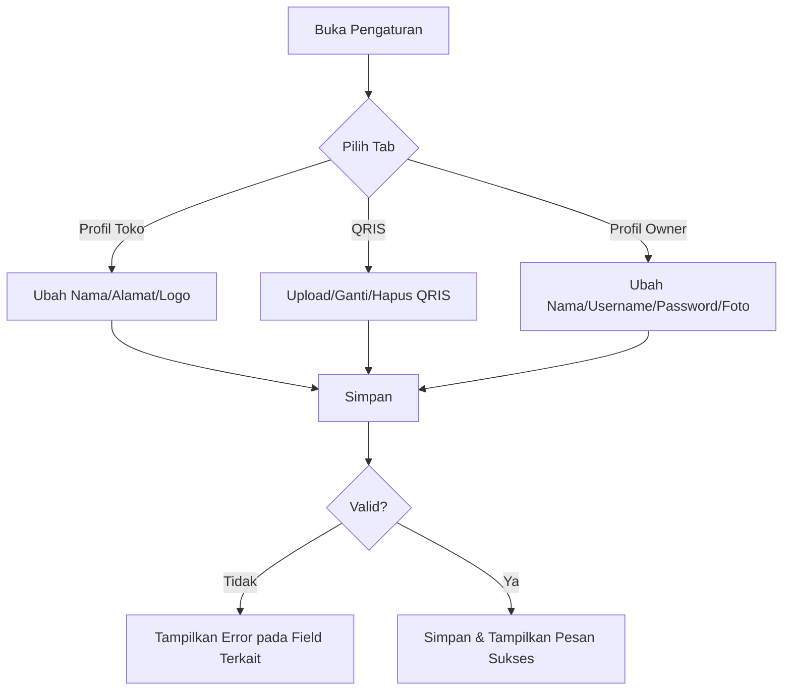
```mermaid
flowchart TD
    A[Buka Pengaturan] --> B{Pilih Tab}
    B -->|Profil Toko| C[Ubah Nama/Alamat/Logo]
    B -->|QRIS| D[Upload/Ganti/Hapus QRIS]
    B -->|Profil Owner| E[Ubah Nama/Username/Password/Foto]
    C --> F[Simpan]
    D --> F
    E --> F
    F --> G{Valid?}
    G -->|Tidak| H[Tampilkan Error pada Field Terkait]
    G -->|Ya| I[Simpan & Tampilkan Pesan Sukses]
```

---

## 23. PROFIL FLOW (Profil Saya — Kasir)

### FL-PROF-01 — Ubah Username

| Field | Detail |
|---|---|
| **Flow ID** | FL-PROF-01 |
| **Flow Name** | Ubah Username oleh Kasir |
| **Actor** | Kasir |
| **Goal** | Kasir mengubah username miliknya sendiri |
| **Pre-condition** | Kasir telah login |
| **Trigger** | Kasir membuka menu "Profil Saya" |
| **Related Screen** | SCR-027 |
| **Business Rules Reference** | BR-KKS-006, BR-AUTH-002 |

**Main Flow:**
1. Kasir membuka menu Profil Saya.
2. Kasir mengubah Username.
3. Kasir menekan "Simpan".
4. Sistem memvalidasi keunikan username baru.
5. Sistem memperbarui data profil.

**Exception Flow:**
- **E1 — Username Baru Duplikat:** Sistem menolak dan menampilkan pesan error.

**Post-condition:** Kasir hanya dapat mengubah profil miliknya sendiri, tidak dapat mengubah role menjadi Owner.

---

### FL-PROF-02 — Ubah Password

| Field | Detail |
|---|---|
| **Flow ID** | FL-PROF-02 |
| **Flow Name** | Ubah Password oleh Kasir |
| **Actor** | Kasir |
| **Goal** | Kasir mengubah password akunnya sendiri |
| **Pre-condition** | Kasir telah login |
| **Trigger** | Kasir membuka menu "Profil Saya" |
| **Related Screen** | SCR-027 |
| **Business Rules Reference** | BR-KKS-006, BR-SEC-001 |

**Main Flow:**
1. Kasir membuka Profil Saya.
2. Kasir mengisi Password baru.
3. Kasir menekan "Simpan".
4. Sistem memvalidasi kriteria password (minimal 8 karakter).
5. Sistem menyimpan password baru dalam bentuk hash.

**Exception Flow:**
- **E1 — Password Lama Tidak Sesuai (jika diminta konfirmasi):** Sistem menolak perubahan password.

**Post-condition:** Password Kasir diperbarui.

---

### FL-PROF-03 — Upload Foto Profil

| Field | Detail |
|---|---|
| **Flow ID** | FL-PROF-03 |
| **Flow Name** | Upload Foto Profil oleh Kasir |
| **Actor** | Kasir |
| **Goal** | Kasir memperbarui foto profil akunnya |
| **Pre-condition** | Kasir telah login |
| **Trigger** | Kasir membuka menu "Profil Saya" |
| **Related Screen** | SCR-027 |
| **Business Rules Reference** | BR-KKS-006, BR-VAL-004 |

**Main Flow:**
1. Kasir membuka Profil Saya.
2. Kasir mengunggah foto profil baru.
3. Kasir menekan "Simpan".
4. Sistem memvalidasi format (JPG/PNG) dan ukuran (maksimum 2MB).
5. Sistem memperbarui foto profil.

**Exception Flow:**
- **E1 — Format/Ukuran Tidak Valid:** Sistem menampilkan pesan format tidak didukung atau ukuran melebihi 2MB.

**Post-condition:** Foto profil Kasir diperbarui dan tampil pada Topbar.

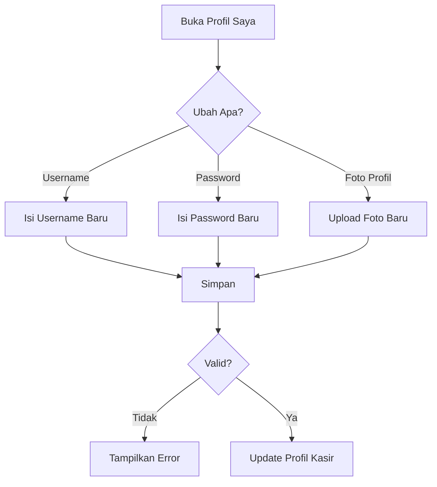
```mermaid
flowchart TD
    A[Buka Profil Saya] --> B{Ubah Apa?}
    B -->|Username| C[Isi Username Baru]
    B -->|Password| D[Isi Password Baru]
    B -->|Foto Profil| E[Upload Foto Baru]
    C --> F[Simpan]
    D --> F
    E --> F
    F --> G{Valid?}
    G -->|Tidak| H[Tampilkan Error]
    G -->|Ya| I[Update Profil Kasir]
```

**Role Differences:** Fungsi "Profil Saya" hanya muncul pada navigasi Kasir; pada Owner, fungsi setara tersedia melalui Pengaturan → Profil Owner (lihat FL-SET-03).

---

## 24. LOGOUT FLOW

### FL-AUTH-03 — Logout

| Field | Detail |
|---|---|
| **Flow ID** | FL-AUTH-03 |
| **Flow Name** | Logout dari Sistem |
| **Actor** | Owner, Kasir |
| **Goal** | Pengguna keluar dari sesi aplikasi secara aman |
| **Pre-condition** | Pengguna sedang login (sesi aktif) |
| **Trigger** | Pengguna menekan tombol/menu "Logout" pada Topbar |
| **Related Screen** | PG-040 (Modal Konfirmasi) |
| **Business Rules Reference** | BR-AUTH-006, BR-SESS-002, NAV-015 |

**Main Flow:**
1. Pengguna menekan tombol/menu "Logout".
2. Sistem menampilkan modal konfirmasi logout (aksi sensitif).
3. Pengguna mengonfirmasi.
4. Sistem menghentikan sesi aktif pengguna **hanya pada perangkat tersebut**.
5. Sistem mengarahkan pengguna kembali ke halaman Login.

**Alternative Flow:**
- **A1 — Batal Logout:** Pengguna menekan "Batal" pada modal konfirmasi; sesi tetap aktif.

**Exception Flow:**
- **E1 — Sesi Sudah Kedaluwarsa:** Jika sesi telah expired sebelum pengguna menekan logout, sistem otomatis mengarahkan ke halaman Login pada request berikutnya (lihat Bagian 26 — Session Timeout Flow).

**Post-condition:** Sesi pengguna pada perangkat tersebut berakhir; sesi pada perangkat lain (jika ada) **tidak terpengaruh** (BR-SESS-002).

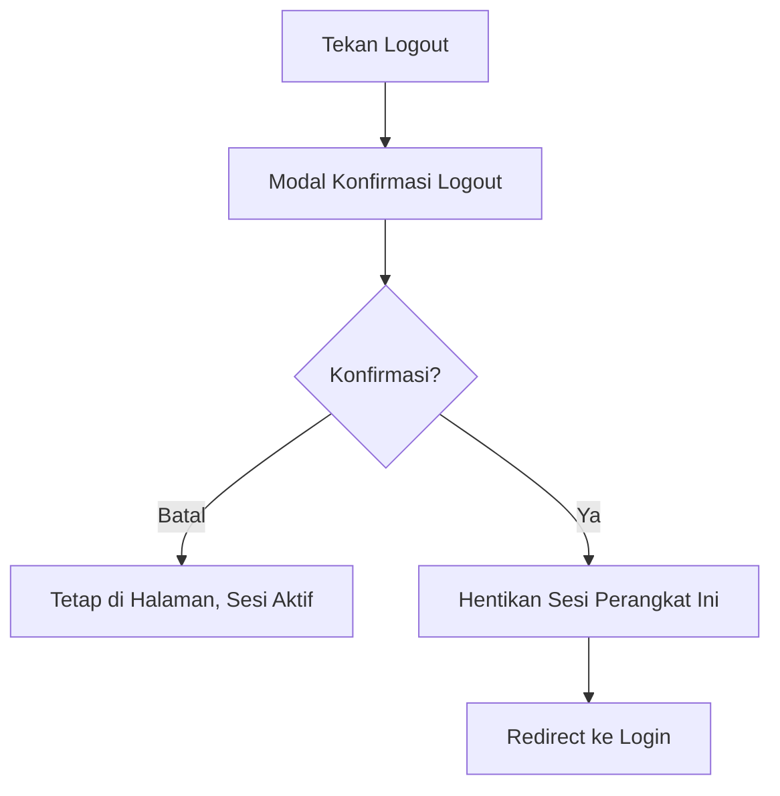
```mermaid
flowchart TD
    A[Tekan Logout] --> B[Modal Konfirmasi Logout]
    B --> C{Konfirmasi?}
    C -->|Batal| D[Tetap di Halaman, Sesi Aktif]
    C -->|Ya| E[Hentikan Sesi Perangkat Ini]
    E --> F[Redirect ke Login]
```

---

## 25. ERROR FLOW

### FL-ERR-01 — 403 Forbidden

| Field | Detail |
|---|---|
| **Flow ID** | FL-ERR-01 |
| **Flow Name** | Akses Ditolak (403) |
| **Actor** | Owner, Kasir |
| **Goal** | Mencegah akses ke halaman/aksi di luar hak role |
| **Pre-condition** | Pengguna telah login dengan role tertentu |
| **Trigger** | Pengguna mengakses menu/URL yang bukan haknya |
| **Related Screen** | PG-043 |
| **Business Rules Reference** | BR-ROLE-003 s.d. BR-ROLE-007 |

**Main Flow:**
1. Pengguna mencoba mengakses halaman/aksi terlarang (via klik atau mengetik URL langsung).
2. Sistem memvalidasi role pada backend dan menolak permintaan.
3. Sistem menampilkan halaman "403 - Anda tidak memiliki akses ke halaman ini" dengan tombol "Kembali ke Dashboard".

**Post-condition:** Aksi tidak dieksekusi; pengguna dapat kembali ke Dashboard sesuai role.

---

### FL-ERR-02 — 404 Not Found

| Field | Detail |
|---|---|
| **Flow ID** | FL-ERR-02 |
| **Flow Name** | Halaman Tidak Ditemukan (404) |
| **Actor** | Owner, Kasir, Publik |
| **Goal** | Menginformasikan bahwa rute yang diakses tidak terdaftar |
| **Pre-condition** | - |
| **Trigger** | Pengguna mengakses URL/rute yang tidak ada dalam sistem |
| **Related Screen** | PG-044 |
| **Business Rules Reference** | BR-ERR-001 |

**Main Flow:**
1. Pengguna mengakses URL yang tidak terdaftar.
2. Sistem menampilkan "Halaman yang Anda cari tidak ditemukan" dengan tombol "Kembali ke Dashboard" (jika sudah login) atau "Kembali ke Login" (jika belum login).

**Post-condition:** Pengguna diarahkan kembali ke halaman yang valid.

---

### FL-ERR-03 — 500 Internal Server Error

| Field | Detail |
|---|---|
| **Flow ID** | FL-ERR-03 |
| **Flow Name** | Kesalahan Sistem (500) |
| **Actor** | Owner, Kasir, Publik |
| **Goal** | Menginformasikan kesalahan sistem tanpa membocorkan detail teknis |
| **Pre-condition** | - |
| **Trigger** | Terjadi kesalahan tak terduga pada backend/koneksi database |
| **Related Screen** | PG-046 |
| **Business Rules Reference** | BR-ERR-002 |

**Main Flow:**
1. Sistem mengalami kegagalan pada sisi server.
2. Sistem menampilkan pesan umum "Terjadi kesalahan pada sistem, silakan coba lagi" beserta kode referensi error (untuk log internal tim teknis), tanpa menampilkan stack trace.
3. Sistem menyediakan tombol "Coba Lagi" atau "Kembali ke Dashboard".

**Post-condition:** Tidak ada detail teknis yang terekspos ke pengguna akhir; kesalahan dicatat untuk keperluan debugging internal.

---

### FL-ERR-04 — Network Error & Maintenance

| Field | Detail |
|---|---|
| **Flow ID** | FL-ERR-04 |
| **Flow Name** | Kesalahan Koneksi / Halaman Pemeliharaan |
| **Actor** | Owner, Kasir, Publik |
| **Goal** | Menginformasikan gangguan koneksi atau pemeliharaan terjadwal |
| **Pre-condition** | - |
| **Trigger** | Koneksi internet terputus, atau sistem dalam masa pemeliharaan |
| **Related Screen** | PG-047, PG-048 |
| **Business Rules Reference** | BR-ERR-001 |

**Main Flow (Network Error):**
1. Koneksi internet pengguna terputus saat berinteraksi dengan sistem.
2. Sistem menampilkan "Koneksi internet Anda terputus, silakan periksa jaringan Anda" dengan tombol "Coba Lagi".

**Main Flow (Maintenance):**
1. Sistem sedang dalam masa pemeliharaan terjadwal.
2. Sistem menampilkan "StoreKuify sedang dalam pemeliharaan, silakan coba beberapa saat lagi" (dengan estimasi waktu jika tersedia); tidak ada aksi lain selain menunggu.

**Post-condition:** Pengguna memahami status gangguan dan dapat mencoba kembali setelahnya.

---

### FL-ERR-05 — Kegagalan Stok Saat Checkout

| Field | Detail |
|---|---|
| **Flow ID** | FL-ERR-05 |
| **Flow Name** | Race Condition Stok Saat Checkout |
| **Actor** | Owner, Kasir |
| **Goal** | Mencegah oversell akibat perubahan stok bersamaan |
| **Pre-condition** | Pengguna sedang dalam proses checkout final |
| **Trigger** | Stok barang berkurang (oleh transaksi lain) sebelum checkout final tersimpan |
| **Related Screen** | SCR-012 |
| **Business Rules Reference** | BR-ERR-004, BR-STK-003 |

**Main Flow:**
1. Sistem melakukan validasi ulang stok tepat sebelum menyimpan transaksi.
2. Sistem mendeteksi stok tidak lagi mencukupi untuk satu/lebih item.
3. Sistem membatalkan proses checkout **tanpa** mengurangi stok maupun menyimpan transaksi.
4. Sistem menampilkan pesan "Stok [Nama Barang] telah berubah, silakan periksa kembali keranjang Anda".
5. Keranjang **tidak hilang** — pengguna dapat menyesuaikan jumlah atau menghapus item bermasalah.

**Post-condition:** Data stok dan transaksi tetap konsisten; pengguna dapat mencoba checkout ulang setelah menyesuaikan keranjang.

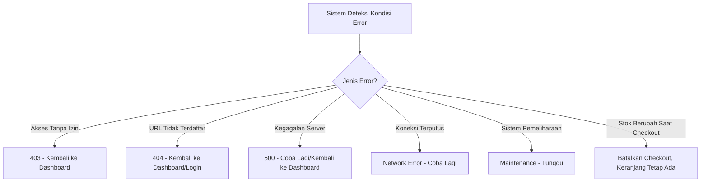
```mermaid
flowchart TD
    A[Sistem Deteksi Kondisi Error] --> B{Jenis Error?}
    B -->|Akses Tanpa Izin| C[403 - Kembali ke Dashboard]
    B -->|URL Tidak Terdaftar| D[404 - Kembali ke Dashboard/Login]
    B -->|Kegagalan Server| E[500 - Coba Lagi/Kembali ke Dashboard]
    B -->|Koneksi Terputus| F[Network Error - Coba Lagi]
    B -->|Sistem Pemeliharaan| G[Maintenance - Tunggu]
    B -->|Stok Berubah Saat Checkout| H[Batalkan Checkout, Keranjang Tetap Ada]
```

---

## 26. SESSION TIMEOUT FLOW

### FL-SESS-01 — Sesi Kedaluwarsa Saat Idle

| Field | Detail |
|---|---|
| **Flow ID** | FL-SESS-01 |
| **Flow Name** | Sesi Login Kedaluwarsa |
| **Actor** | Owner, Kasir |
| **Goal** | Melindungi akun dari akses tidak sah akibat sesi yang terlalu lama tidak aktif |
| **Pre-condition** | Pengguna memiliki sesi aktif |
| **Trigger** | Sesi login melewati batas waktu (expired) |
| **Related Screen** | PG-049 |
| **Business Rules Reference** | BR-ERR-005, BR-SESS-001 |

**Main Flow:**
1. Sesi login pengguna kedaluwarsa (idle melewati batas waktu).
2. Pada permintaan berikutnya, sistem mendeteksi sesi tidak valid.
3. Sistem menampilkan pesan "Sesi Anda telah berakhir, silakan login kembali".
4. Sistem mengarahkan pengguna ke halaman Login.

**Post-condition:** Pengguna harus login kembali untuk melanjutkan aktivitas.

---

### FL-SESS-02 — Sesi Kedaluwarsa Saat Transaksi Berlangsung

| Field | Detail |
|---|---|
| **Flow ID** | FL-SESS-02 |
| **Flow Name** | Sesi Berakhir di Tengah Transaksi Kasir |
| **Actor** | Owner, Kasir |
| **Goal** | Meminimalkan kehilangan data transaksi akibat sesi berakhir mendadak |
| **Pre-condition** | Pengguna sedang berada di halaman Kasir/Checkout dengan keranjang berisi barang |
| **Trigger** | Sesi login kedaluwarsa saat proses transaksi berlangsung |
| **Related Screen** | PG-049 |
| **Business Rules Reference** | BR-ERR-005 |

**Main Flow:**
1. Sesi pengguna kedaluwarsa saat keranjang/checkout sedang berlangsung.
2. Sistem menyimpan sementara data keranjang jika memungkinkan secara teknis (client-side).
3. Sistem mengarahkan pengguna ke halaman Login dengan pesan "Sesi Anda telah berakhir, silakan login kembali".
4. Setelah login ulang, pengguna diarahkan ke Dashboard (keranjang yang tersimpan sementara dapat dipulihkan tergantung implementasi state management, sesuai NAV-008).

**Post-condition:** Transaksi yang belum di-checkout berpotensi perlu diinput ulang; transaksi yang **sudah** berhasil disimpan ke database tidak terpengaruh sama sekali.

---

### FL-SESS-03 — Akun Dinonaktifkan Owner Saat Kasir Sedang Login

| Field | Detail |
|---|---|
| **Flow ID** | FL-SESS-03 |
| **Flow Name** | Paksa Logout Akibat Akun Dinonaktifkan |
| **Actor** | Kasir |
| **Goal** | Mencegah Kasir yang telah dinonaktifkan tetap mengakses sistem |
| **Pre-condition** | Kasir sedang memiliki sesi aktif |
| **Trigger** | Owner menonaktifkan akun Kasir tersebut melalui Kelola Kasir |
| **Related Screen** | PG-049, SCR-001 |
| **Business Rules Reference** | BR-KKS-004 |

**Main Flow:**
1. Owner menonaktifkan akun Kasir yang sedang login (lihat FL-KKS-04).
2. Pada request berikutnya yang dilakukan Kasir, sistem menolak sesi tersebut.
3. Sistem mengarahkan Kasir ke halaman Login dengan pesan sesuai kondisi akun nonaktif.

**Post-condition:** Kasir tidak dapat mengakses halaman manapun sampai akunnya diaktifkan kembali oleh Owner.

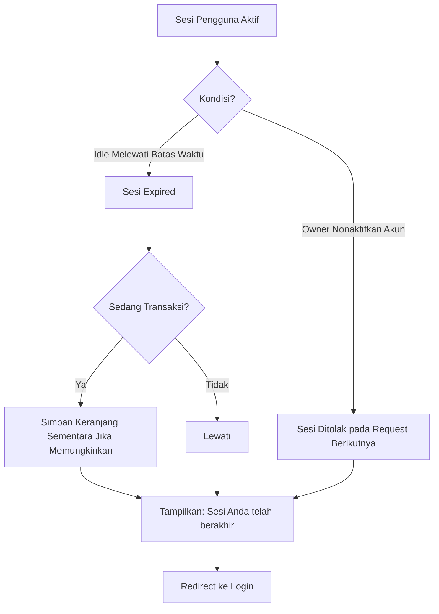
```mermaid
flowchart TD
    A[Sesi Pengguna Aktif] --> B{Kondisi?}
    B -->|Idle Melewati Batas Waktu| C[Sesi Expired]
    B -->|Owner Nonaktifkan Akun| D[Sesi Ditolak pada Request Berikutnya]
    C --> E{Sedang Transaksi?}
    E -->|Ya| F[Simpan Keranjang Sementara Jika Memungkinkan]
    E -->|Tidak| G[Lewati]
    F --> H[Tampilkan: Sesi Anda telah berakhir]
    G --> H
    D --> H
    H --> I[Redirect ke Login]
```

---

## 27. FUTURE USER FLOW

Alur berikut **belum berlaku** pada versi StoreKuify saat ini, dicatat sebagai referensi awal untuk pengembangan lanjutan, konsisten dengan Future Scope (02_PRD.md), Future Business Rules (03_Business_Rules.md), Future Information Architecture (04_Information_Architecture.md), dan Future Sitemap (05_Sitemap.md):

| No | Future Flow | Deskripsi Singkat | Referensi |
|---|---|---|---|
| 1 | Flow Pemilihan Toko/Cabang | Alur tambahan sebelum Dashboard untuk memilih cabang pada dukungan multi-toko | Future Scope #1, BR-GEN-002 (future) |
| 2 | Flow Verifikasi QRIS Otomatis | Alur checkout QRIS dengan callback/webhook otomatis menggantikan konfirmasi manual kasir | Future Scope #2, Future BR #2 |
| 3 | Flow Notifikasi Stok Menipis & Hutang Jatuh Tempo | Alur notifikasi WhatsApp/Telegram/Email otomatis dengan drill-down ke Detail Barang/Detail Hutang | Future Scope #4, Future BR #1 & #5 |
| 4 | Flow Cetak Struk Thermal | Alur cetak fisik menggunakan printer thermal 58mm/80mm sebagai bagian dari Struk Transaksi | Future Scope #5 |
| 5 | Flow Pencarian Barcode | Alur input tambahan (scan barcode) berjalan berdampingan dengan pencarian nama pada halaman Kasir | Future Scope #6, Future BR #4 |
| 6 | Flow Manajemen Supplier & Purchase Order | Alur pencatatan pembelian dari supplier secara terstruktur | Future Scope #7 |
| 7 | Flow Program Loyalti Pelanggan | Alur akumulasi poin dan penukaran reward terkait Checkout dan Detail Hutang Pelanggan | Future Scope #8, Future BR #8 |
| 8 | Flow Ekspor Laporan PDF/Excel | Alur ekspor data laporan ke format eksternal dari halaman Laporan | Future Scope #9, Future BR #6 |
| 9 | Flow Role Supervisor | Alur navigasi dan hak akses tambahan untuk role Supervisor di antara Owner dan Kasir | Future Scope #10, Future BR #7 |

**Catatan:** Seluruh Future User Flow di atas tidak diimplementasikan pada versi ini dan tidak boleh memengaruhi desain UI/UX maupun pengembangan versi saat ini, kecuali sebagai pertimbangan agar struktur data dan navigasi tidak menyulitkan pengembangan lanjutan (selaras dengan NFR-03 pada 02_PRD.md).

---

## 28. GLOSSARY

| Istilah | Definisi |
|---|---|
| **Owner** | Pemilik warung kelontong dengan akses penuh terhadap seluruh fitur StoreKuify. |
| **Kasir** | Staf operasional yang bertugas melayani transaksi penjualan dengan akses terbatas. |
| **User Flow** | Dokumentasi langkah demi langkah bagaimana pengguna berinteraksi dengan sistem untuk mencapai suatu tujuan. |
| **Happy Path** | Jalur normal suatu alur ketika seluruh langkah berhasil tanpa kendala. |
| **Alternative Flow** | Jalur alternatif yang tetap valid namun berbeda dari happy path. |
| **Exception Flow** | Kondisi pengecualian yang mengganggu jalur normal suatu proses. |
| **Decision Point** | Titik dalam alur di mana sistem/pengguna harus menentukan cabang berikutnya. |
| **Kategori Barang** | Pengelompokan barang berdasarkan jenisnya (contoh: Sabun, Makanan, Minuman, Bumbu). |
| **Barang** | Item/produk yang dijual di warung, memiliki atribut nama, harga modal, harga jual, stok, dan foto (opsional). |
| **Harga Modal** | Harga pokok/biaya perolehan barang sebelum dijual. |
| **Harga Jual** | Harga yang dibebankan kepada pelanggan saat membeli barang. |
| **Keuntungan (Margin)** | Selisih antara Harga Jual dan Harga Modal, dihitung otomatis berdasarkan harga saat transaksi terjadi. |
| **Keranjang (Cart)** | Kumpulan sementara barang yang dipilih pengguna sebelum proses checkout, belum memengaruhi stok. |
| **Checkout** | Proses penyelesaian transaksi penjualan yang mengubah keranjang menjadi transaksi permanen. |
| **QRIS Statis** | Kode QR pembayaran yang bersifat tetap (gambar tunggal milik toko), tanpa integrasi otomatis dengan payment gateway. |
| **Hutang** | Kewajiban pembayaran pelanggan atas transaksi yang belum dibayar lunas. |
| **Outstanding Hutang** | Sisa nominal hutang yang belum dibayar oleh pelanggan. |
| **Cicilan** | Pembayaran hutang yang dilakukan secara bertahap/sebagian, bukan sekaligus lunas. |
| **Dashboard** | Halaman ringkasan yang menampilkan indikator penting bisnis sesuai role pengguna. |
| **Laporan** | Modul yang menyajikan data agregat penjualan dan keuntungan berdasarkan periode waktu tertentu. |
| **Role-Based Access Control (RBAC)** | Mekanisme pembatasan akses fitur/menu berdasarkan peran pengguna (Owner/Kasir). |
| **Stok Hampir Habis** | Kondisi dimana jumlah stok barang berada di bawah atau sama dengan ambang batas minimum yang ditentukan. |
| **Barang Nonaktif** | Barang yang dinonaktifkan oleh Owner sehingga tidak dapat dijual, namun tetap tampil pada Data Barang. |
| **Session/Sesi** | Status login pengguna yang aktif pada suatu perangkat setelah berhasil autentikasi. |
| **Session Timeout** | Kondisi ketika sesi login pengguna berakhir secara otomatis akibat batas waktu tidak aktif atau kedaluwarsa. |
| **Race Condition** | Kondisi ketika dua atau lebih proses (contoh: dua kasir menjual barang yang sama secara bersamaan) berpotensi menghasilkan data yang tidak konsisten jika tidak ditangani dengan benar. |
| **Snapshot Harga** | Nilai Harga Modal dan Harga Jual yang disimpan pada level transaksi saat transaksi terjadi, terpisah dari harga terkini pada master data Barang. |
| **Breadcrumb** | Elemen navigasi yang menampilkan jejak posisi pengguna dalam hierarki halaman. |
| **Drill-Down Navigation** | Pola navigasi berjenjang di mana pengguna masuk lebih dalam ke suatu hierarki data. |
| **Cross Navigation** | Perpindahan kontekstual antar modul yang berbeda, di luar jalur sidebar utama. |
| **Modal/Dialog** | Lapisan tambahan di atas halaman aktif untuk aksi cepat tanpa berpindah halaman penuh. |
| **Unsaved Changes** | Kondisi ketika pengguna memiliki perubahan pada form yang belum disimpan ke sistem. |
| **Empty State** | Kondisi tampilan suatu halaman ketika belum ada data untuk ditampilkan. |
| **Loading State** | Kondisi tampilan sementara suatu halaman ketika sistem sedang memuat data dari server. |
| **Error Page** | Halaman yang ditampilkan ketika terjadi kondisi kesalahan tertentu (401, 403, 404, 419, 500, Network Error, Maintenance, Session Expired). |
| **Audit Trail** | Jejak/log pencatatan perubahan data penting beserta informasi aktor dan waktu perubahan. |
| **Atomic Transaction (Database)** | Eksekusi sekumpulan operasi data sebagai satu unit tak terpisahkan — seluruhnya berhasil atau seluruhnya dibatalkan (rollback). |

---

**— AKHIR DOKUMEN 06_User_Flow.md —**
